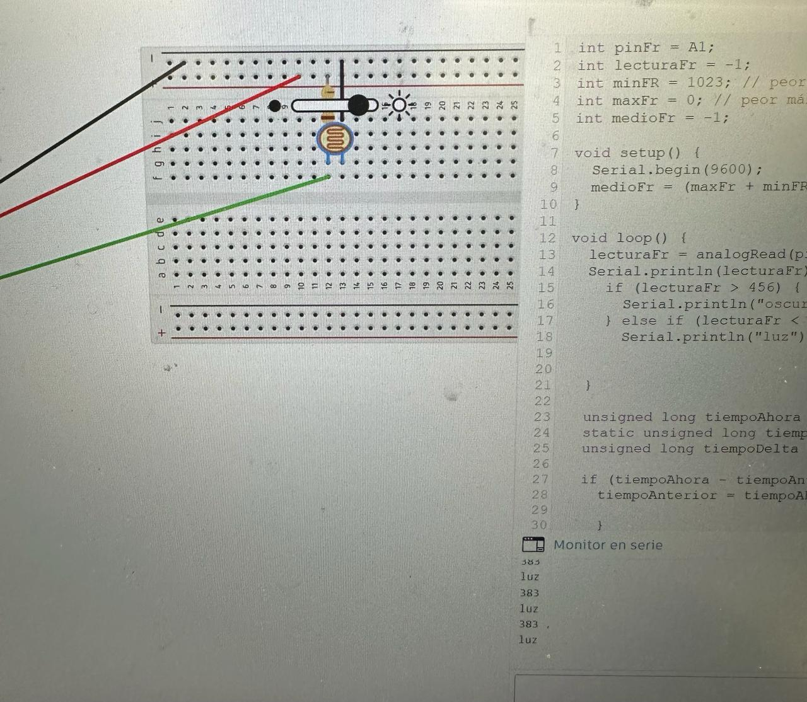

# clase-05

1. aprendimos las diferencias entre float e int (float es un numero decimal int entero)
1. aprendimos como poder ajustar un foto resistor para que pueda funcionar apesar de estar en distintas condiciones
1. aprendimos que delay es una mala idea ya que se congela el arduino y puede producir un atraso en general
1. aprendimos la funcion millies en remplazo de delay

**simulación**


**codigo**
 
```cpp
int pinFr = A1;
int lecturaFr = -1;
int minFR = 1023; // peor mínimo del fotoresistor
int maxFr = 0; // peor máximo del fotoresistor
int medioFr = -1;

void setup() {
  Serial.begin(9600);
  medioFr = (maxFr + minFR) / 2;
}

void loop() {
  lecturaFr = analogRead(pinFr);
  Serial.println(lecturaFr);
    if (lecturaFr > 456) {
      Serial.println("oscuridad");
    } else if (lecturaFr < 456) {
      Serial.println("luz");

 
  }

  unsigned long tiempoAhora = millis();
  static unsigned long tiempoAnterior = 0;
  unsigned long tiempoDelta = 1000;

  if (tiempoAhora - tiempoAnterior > tiempoDelta) {
    tiempoAnterior = tiempoAhora;
  
    }
  }


