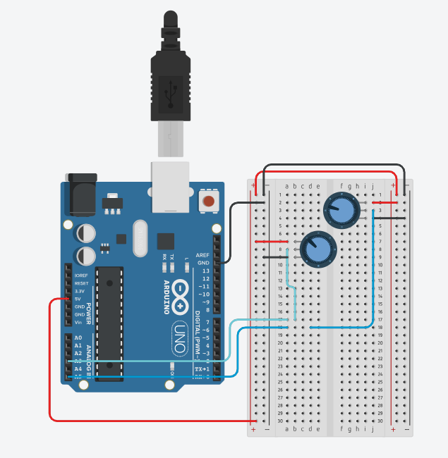

# clase-04
Mi primera clase.

Leyendo codigos de [mrjohnk](<https://github.com/mrjohnk/PMW3389DM>) buscando codigos que permitan traducir señales de arduino a coordenadas para el mouse.El usuario BenMakesEverything hizo [su propio mouse](<https://github.com/BenMakesEverything/PMW3389_Mouse>) basandose en el codigo de mrjohnk.

Desarrollé un [código de arduino](./Mouse1/Mouse1.ino) que permite usar potenciometros para fijar coordenadas. 
Modele el circuito que hace funcionar este codigo en tinkercad.

