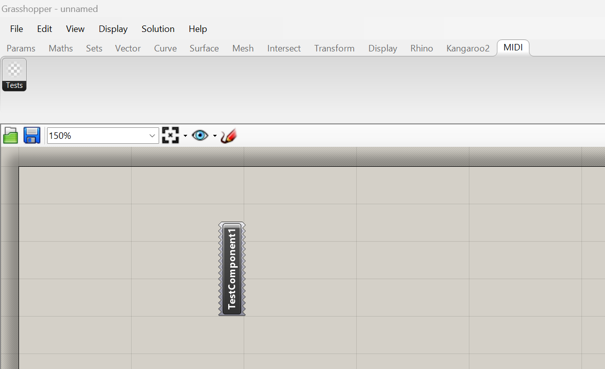

# Clase 13 06/06/2024

Tengo que avanzar mucho ya que la clase pasada no vine y no me quiero atrasar más.

## Crear una lista y asignarle variables

Mientras intennto conectar el teclado a Grasshopper 3D, tambièn tengo que desarrollar un método para que el teclado sepa cuál slider editar.

Para esto debo crear una lista que inmediatamente agregue todos los sliders en forma de números, que luego podrán ser llamados y editados usando las teclas y el pitch bend.

Esto debo lograrlo al mismo tiempo en un nuevo plugin para grasshopper.

Para ello descarguè una extensiºn en Visual Studio 2022 llamada Grasshopper Assembly for Rhino 3D, la cual serª de gran ayuda para crear un plugin que cualquiera pueda usar.

Lamentablemente tengo que irme antes ya que tengo kinesiólogo.

-------------------------------------------------------------------------------------------------------------------------------------------------------------------------------

## Cambiar a clase 14

Luego del kinesiólogo tratè de crear mi primer plugin, este paso es muy necesario ya que es la prueba de que podre pasar un condigo en C# del Visual Studio al GrassHopper, lamentablemente las cosas no salieron del todo bien, ya que en mi primer intento descubrí que usar una version crackeada de rhino no es la mejor idea a la hora de crear nuevas herramientas.

Esto se debe principalente a algo llamado Software Develoment Kit (SDK).

El problema que tuve fue que el SDK de mi version de rhino es demasiado antigua y no es compatible con niungun template que haya podido encotrar en internet.

Finalmente la solución fue descargar una version de prueba de Rhino 8 (la versión mas reciente posible) y de ahora en adelante trabajar en esta versión.

Afortunadamente la mayoría de mis códigos de Grasshopper son compatibles con el Grasshopper de rhino 8, excepto por algunos códigos que incluyen plugins que no son compatibles con el nuevo SDK.

Aprovechando, también creo que será importante recordar que los plugins que haga para Rhino 8 deben estar en el framework .Net4.8.

Luego de todo este lío, finalmente cree mi primer componente en Rhino 8, el cual no hace absolutamente nada, solo existe, igual que yo.

