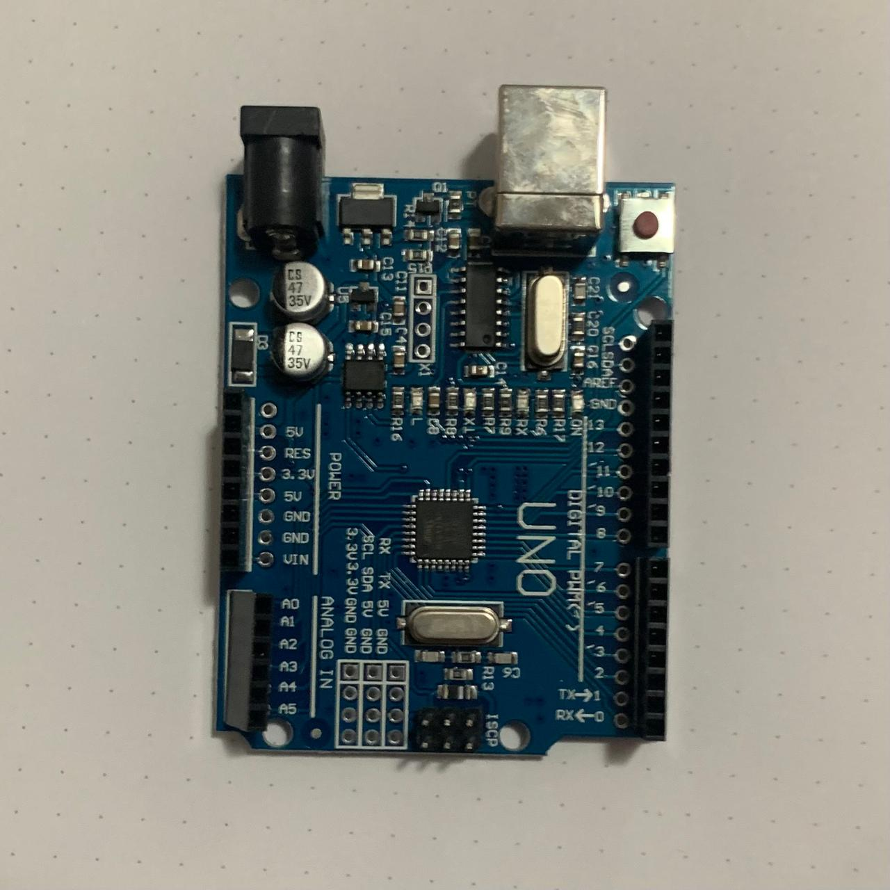
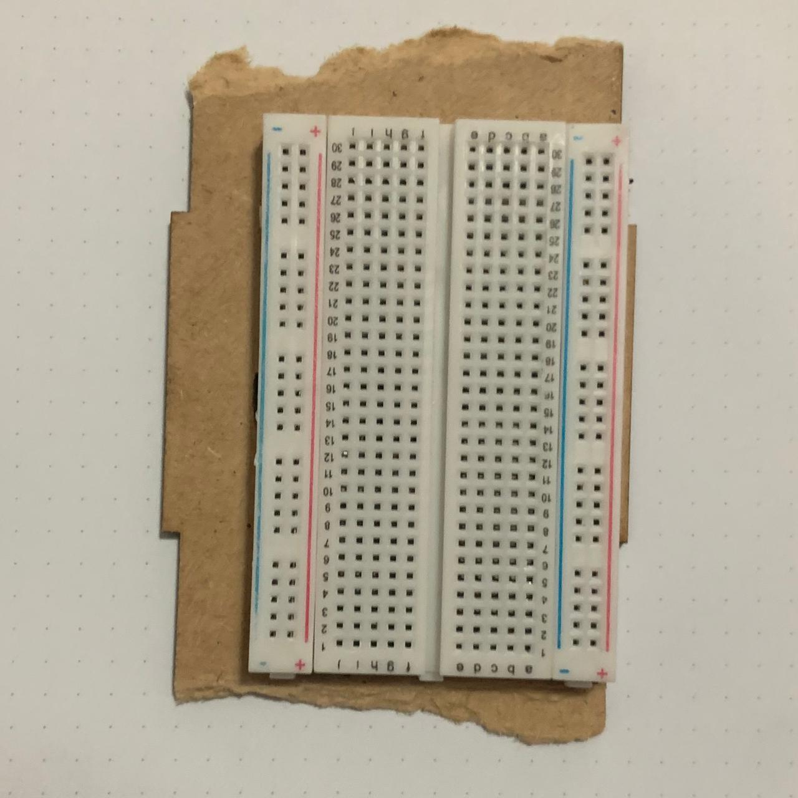
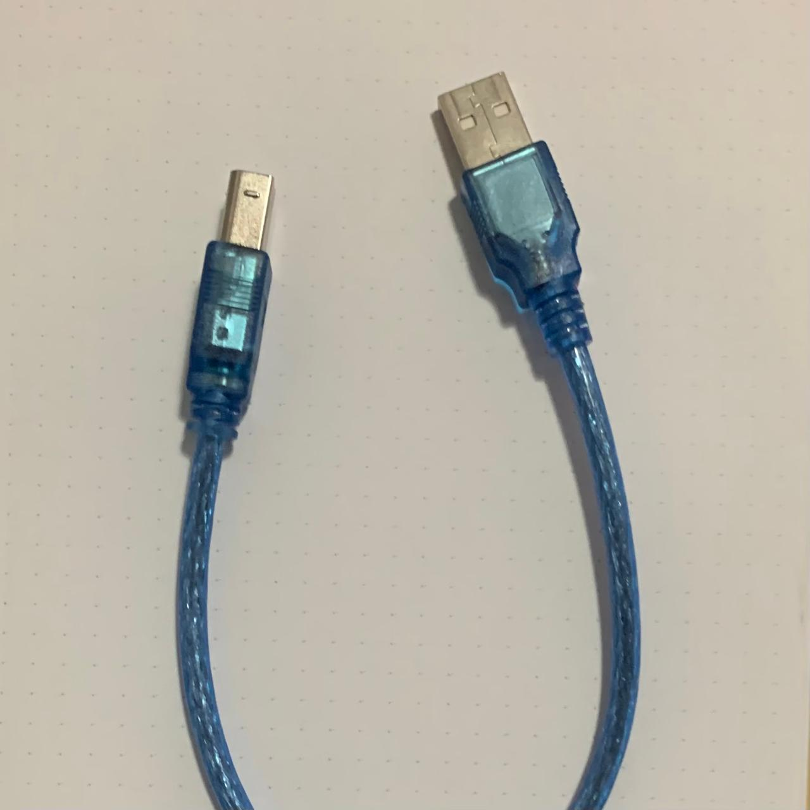
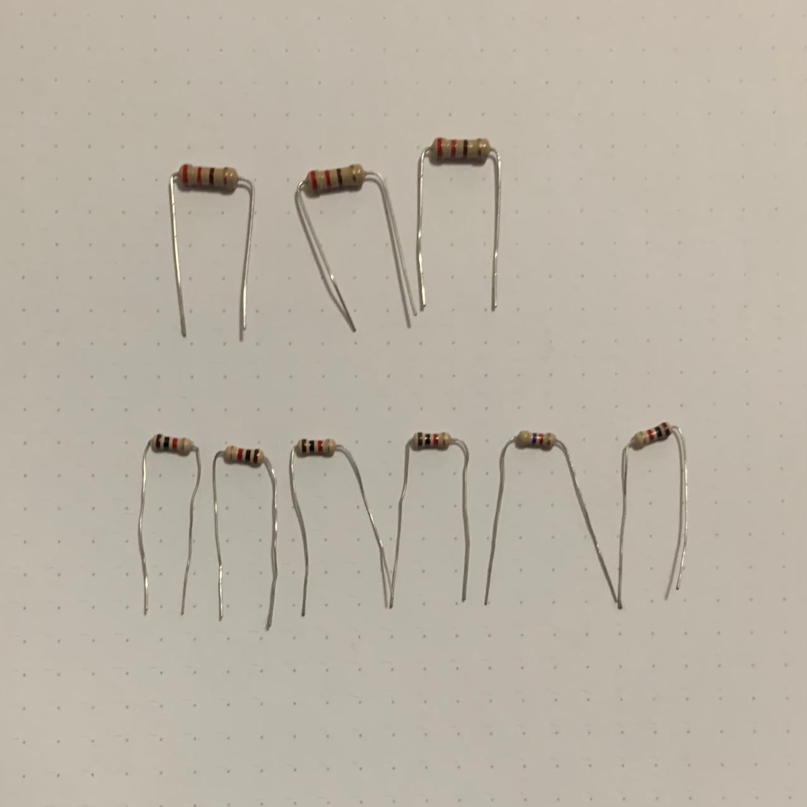
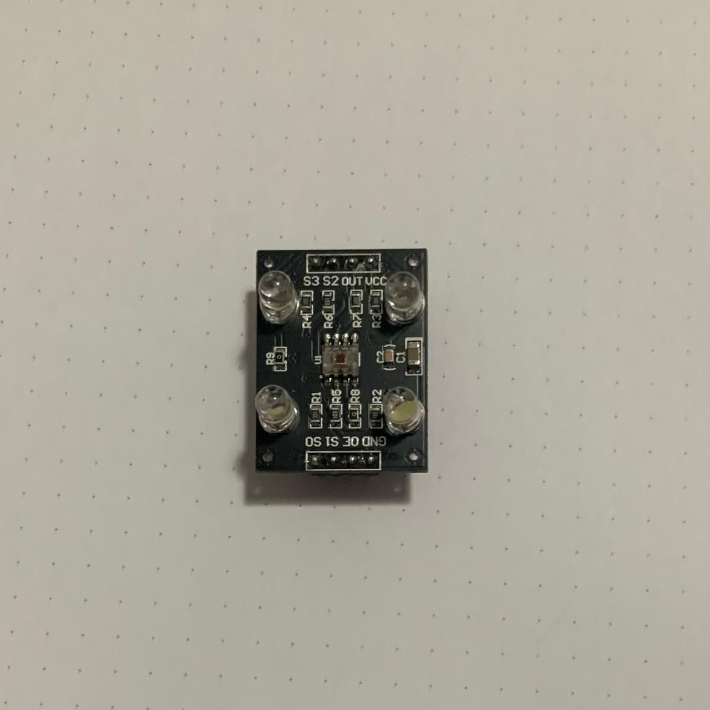
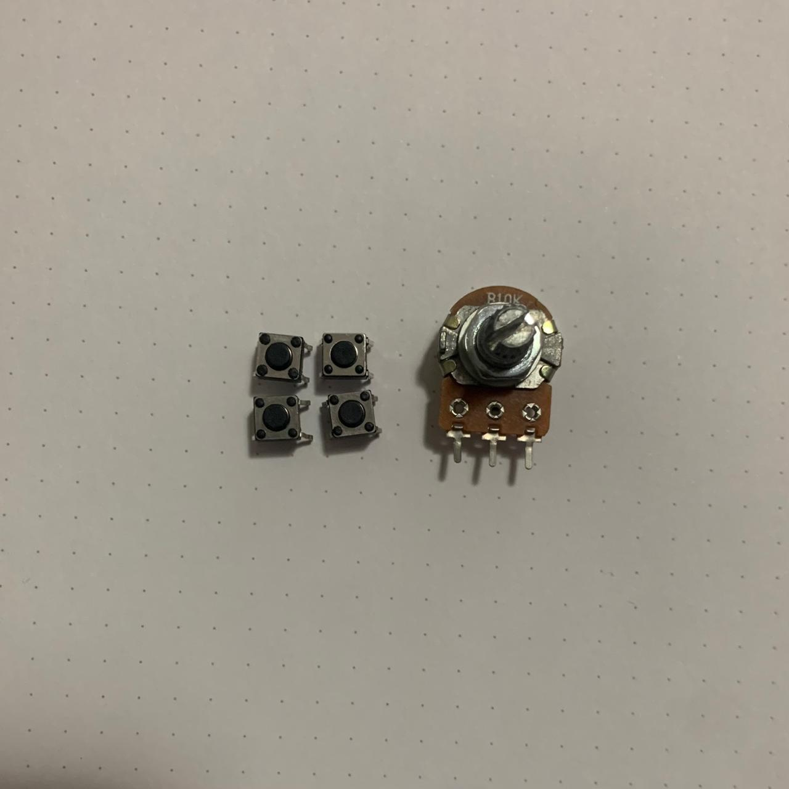
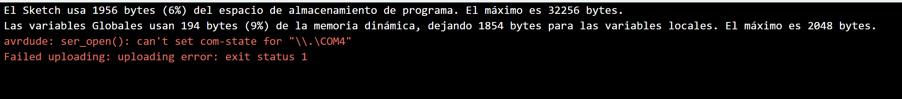

<<<<<<< main
HOLA EN TITULO
==
HOLA EN SUBTITULO
--

LINK DE COMANDOS: https://github.com/adam-p/markdown-here/wiki/Markdown-Cheatsheet









- Arduino UNO R3
- Protoborad
- Cable USB
- Cables Dupont
- Resistencias
- Sensor de color
- Botones y potenciometro

```cpp
// Para encontrar el acento al reves
// Buscar backtick
void setup()
{
int x = 0;
}
```

=======

# índice

- [clase-01](./clase-01)
- [clase-02](./clase-02)
- [clase-03](./clase-03)
- [clase-04](./clase-04)
- [clase-05](./clase-05)
- [clase-06](./clase-06)
- [clase-07](./clase-07)
- [clase-08](./clase-08)
- [clase-09](./clase-09)
- [clase-10](./clase-10)
- [clase-11](./clase-11)
- [clase-12](./clase-12)
  > > > > > > > main



