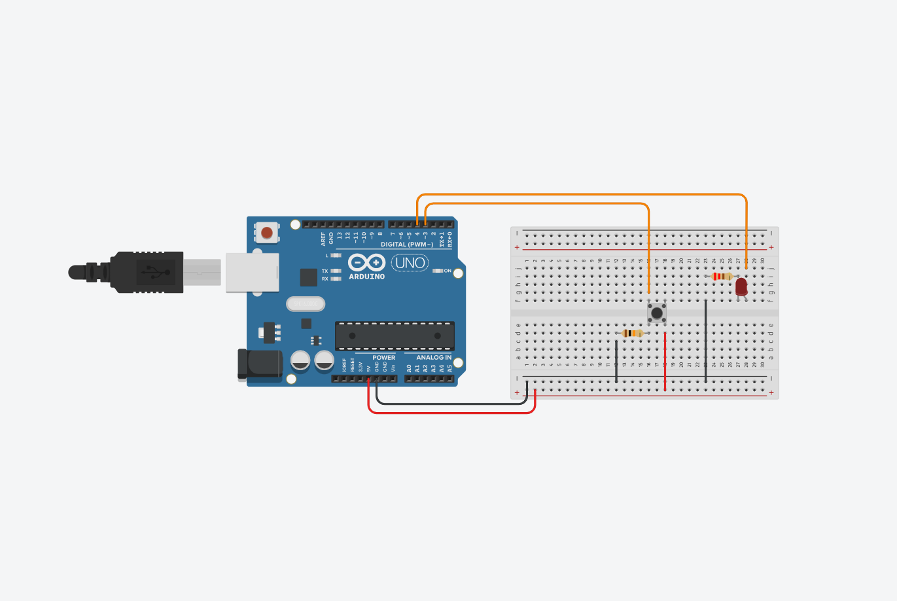

# clase-05 (04/04/2024)

## Codigo fotoresistor + led

Con mis compañeros Valentina Tiznado y Mauricio Viveros creamos este codigo que enciende un led dependiendo del valor que arroja un fotoresitor.

```cpp

int pinLedNaranjo = 7; //Indicamos el pin del led naranjo
int pinFR = A3; //Indicamos el pin del fotoresistor
int estadoFR = 0; //Indicamos le estado del fotoresistor
int minFR = 1023; //Indicamos el valor del peor minimo
int maxFR = 0; //Indicamos el valor del peor maximo
int medioFR = (minFR + maxFR)/2; //Indicamos el parametro para la luz 

void setup()
{
  pinMode(pinLedNaranjo, OUTPUT); //Determinamos que el led es una salida
  Serial.begin(9600); //Iniciamos comunicacion serial
}

void loop()
{
  estadoFR = analogRead(pinFR); //Leemos estado del fotoresistor 
  
  if(estadoFR < minFR) //Condicion para buscar el minimo valor del fotoresitor 
  {
    minFR = estadoFR; //Actualizamos minimo valor 
    Serial.print("EL MINIMO ES: "); //Mostramos mensaje en el monitor
    Serial.println(minFR); //Mostramos el valor del minimo valor en el monitor
  }
  
  if(estadoFR > maxFR) //Condicion para buscar el maximo valor del fotoresitor
  {
    maxFR = estadoFR; //Actualizamos maximo valor 
    Serial.print("EL MAXIMO ES: "); //Mostramos mensaje en el monitor
    Serial.println(maxFR); //Mostramos el valor del maximo valor en el monitor
  }
  
  if(estadoFR > medioFR) //Condicion para determinar si se enciende o no el led
  {
    digitalWrite(pinLedNaranjo, HIGH); //Encendemos el led si se cumple la condicion
    Serial.print(estadoFR); //Mostramos el valor del fotoresistor en el monitor
    Serial.print(": "); //Mostramos mensaje en el monitor
    Serial.println("LUZ"); //Mostramos mensaje en el monitor
  }
  else 
  {
    digitalWrite(pinLedNaranjo, LOW); //Apagamos el led si no se cumple la condicion anterior 
    Serial.print(estadoFR); //Mostramos el valor del fotoresistor en el monitor
    Serial.print(": "); //Mostramos mensaje en el monitor
    Serial.println("OSCURIDAD"); //Mostramos mensaje en el monitor
  }
}

```

## Codigo boton + led para que se prenda solo al hacer doble clic

Con mis compañeros Valentina Tiznado y Mauricio Viveros creamos este codigo para poder hacer que el led rojo solo se prenda si se apreta el clic dos veces seguidas, pero no entiendo por que no funciona el codigo. Comprobe con los valores y las condiciones se cumplen pero aun asi no lo veo reflejado en el encendido del led. 

```cpp

int pinLedRojo = 4; //Indicamos el pin del led rojo
int pinBoton = 3; //Indicamos el pin del boton
int estadoAntBoton = LOW; //Indicamos el estado inicial del boton
unsigned long tiempoClic = 0; //Creamos la variable para almacenar el tiempo del clic
unsigned long tiempoAct = 0; //Creamos la variable para almacenar el tiempo actual
unsigned long tiempoDelta = 1000; //Creamos la variable delta

void setup()
{
  pinMode(pinBoton, INPUT); //Determinamos que el boton es una entrada
  pinMode(pinLedRojo, OUTPUT); //Determinamos que el led es una salida
  Serial.begin(9600); //Iniciamos comunicacion serial
}

void loop()
{
  int estadoActBoton = digitalRead(pinBoton); //Leemos el estado del boton
  tiempoAct = millis(); //Definimos el tiempo actual
  
  if(estadoActBoton == HIGH && estadoAntBoton == LOW) //Creamos condicion para saber si boton fue pulsado
  {
    if(tiempoAct - tiempoClic < tiempoDelta) //Definimos condicion para saber si el tiempo entre un clic y otro es menor a delta
    {
      digitalWrite(pinLedRojo, HIGH); //Encendemos led si se cumple la condicion
    }
    Serial.print("EL TIEMPO ACTUAL ES: "); //Mostramos mensaje en el monitor
    Serial.println(tiempoAct); //Mostramos el valor del tiempo actual en el monitor
    Serial.print("EL TIEMPO DEL CLIC ES: "); //Mostramos mensaje en el monitor
    Serial.println(tiempoClic); //Mostramos el valor del tiempo del clic en el monitor 
    Serial.print("EL TIEMPO DELTA ES: "); //Mostramos mensaje en el monitor
    Serial.println(tiempoDelta); //Mostramos mensaje del tiempo delta en el monitor 
  }
  
  else
  {
    digitalWrite(pinLedRojo, LOW); //Si no se cumple la condicion anterior se mantiene apagado el led
  }
  
  estadoAntBoton = estadoActBoton; //Actualizamos el estado del boton
 
  if(estadoActBoton == HIGH) //Definimos condicion sobre si se pulso o no el boton
  {
    tiempoClic = tiempoAct; //Actualizamos el tiempo del clic al estado actual (ese momento preciso)
  }
}

```

Aca dejo una imagen del circuito en Tinkercad


