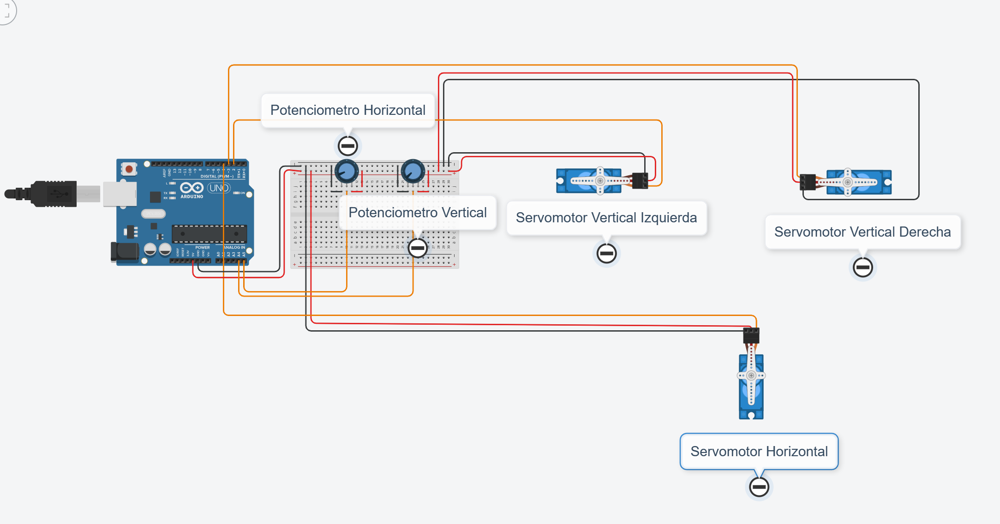

# Clase-09 (02/05/2024)

## Codigo Inicial

Con el siguiente codigo logro que a traves de un potenciometro giren dos servomotores de la misma manera, con el fin de que suban o bajen las varas laterales de igual manera, y que con otro potenciometro gire otro servomotor con el fin de que las varas se cierren o se abran. 



```cpp

#include <Servo.h> 
//Agregamos libreria del servomotor

Servo servo_Ver_Izq; //Nombramos el servo vertical izquierdo
Servo servo_Ver_Der; //Nombramos el servo vertical derecho 
Servo servo_Hor; //Nombramos el unico servo horizontal 

int pot_Ver = A4; //Asignamos pin a potenciometro de la vertical
int pot_Hor = A5; //Asignamos pin a potenciometro de la horizontal
int val_pot_Ver = 0; //Creamos valor inicial del potenciometro vertical
int val_pot_Hor = 0; //Creamos valor inicial del potenciometro horizontal

void setup()
{
  pinMode(pot_Ver, INPUT); //Indicamos que el potenciometro vertical es una salida
  pinMode(pot_Hor, INPUT); //Indicamos que el potenciometro horizontal es una salida
  servo_Ver_Izq.attach(2, 1000, 2500); //Asignamos pin al servo vertical izquierdo
  servo_Ver_Der.attach(3, 1000, 2500); //Asignamos pin servo vertical derecho
  servo_Hor.attach(4, 1000, 2500); //Asignamos pin al unico servo horizontal
}

void loop()
{
  val_pot_Ver = analogRead(pot_Ver); //Actualizamos el valor del potenciometro vertical
  val_pot_Hor = analogRead(pot_Hor); //Actualizamos el valor del potenciometro horizontal
  servo_Ver_Izq.write(map(val_pot_Ver, 0, 1023, 0, 360)); //Hacemos que el servo vertical izquierdo gire de acuerdo al potenciometro
  servo_Ver_Der.write(map(val_pot_Ver, 0, 1023, 0, 360)); //Hacemos que el servo vertical derecho gire de acuerdo al potenciometro
  servo_Hor.write(map(val_pot_Hor, 0, 1023, 0, 360)); //Hacemos que el unico servo horizontal gire de acuerdo al potenciometro
  delay(10);
}

```
