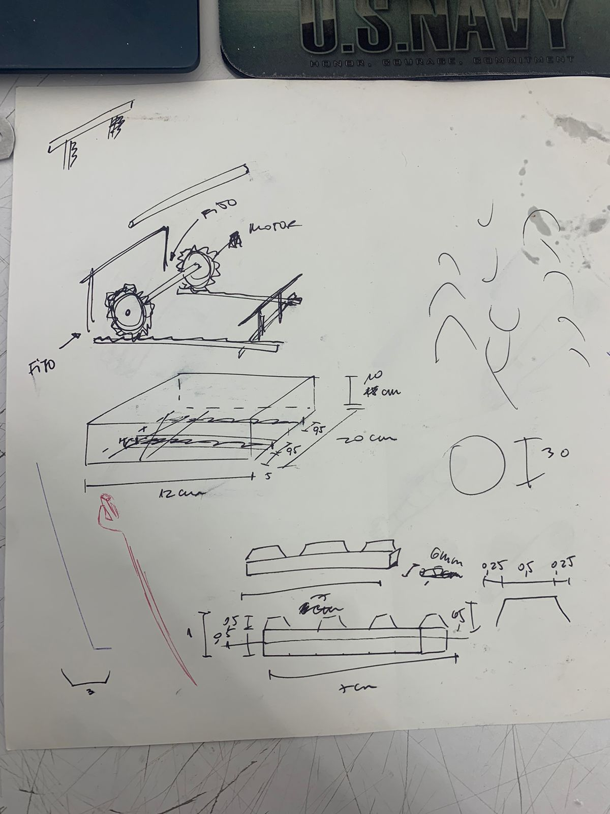
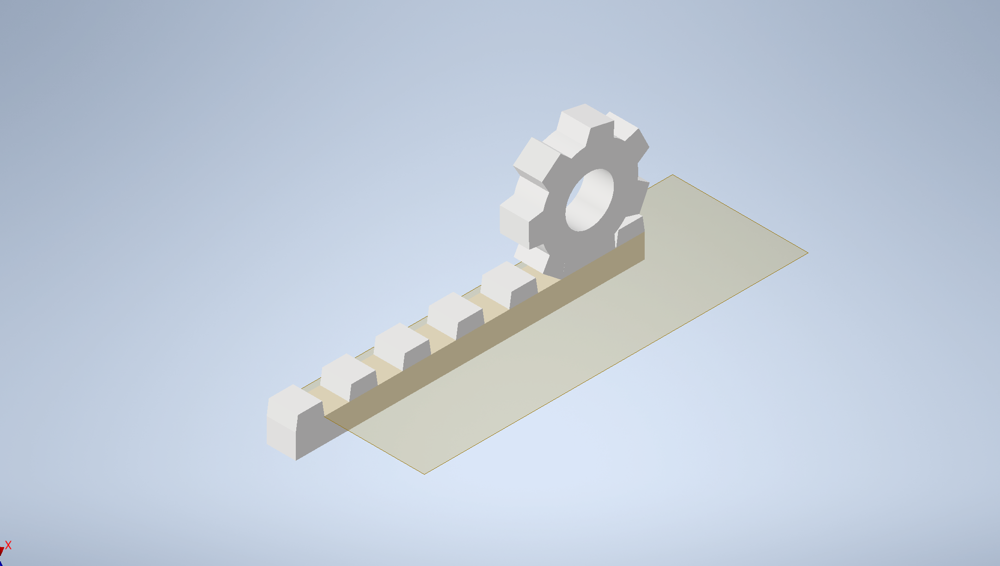

# Clase-10 (16/05/2024)

En esta clase, me dedique a prbar los mecanismos para mi proyecto en Inventor, pero no me gusto mucho mi resultado ya que no me funciona como me gustaria. Voy a hablar con mi profe de Diseño y Mecanismos para que me ayude a hacerlo y quede como a mi me gustaria, pero hasta ahora este es el avance.

El mecanismo consta de 2 piñones y 2 cremalleras para el movimiento horizontal (impulsado por un servomotor), y de 2 piñones y 2 cremalleras para el movimiento vertical (tambien impulsado por un servomotor). Aca se muestra como seria un piñon con una cremallera y los dibujos que hice para poder modelarlo de la mejor manera.





```cpp

//Codigo creado por Martin Gonzalez Marin
//16/05/2024
//Codigo que activa servomotores en funcion de potencionetros con el fin de tensar la piel

//Agregamos libreria del servomotor
#include <Servo.h> 

//Nombramos el servo vertical izquierdo
Servo servoVerIzq; 
//Nombramos el servo vertical derecho 
Servo servoVerDer; 
//Nombramos el unico servo horizontal 
Servo servoHor; 

//Asignamos pin a potenciometro de la vertical
int potVer = A4; 
//Asignamos pin a potenciometro de la horizontal
int potHor = A5; 
//Creamos valor inicial del potenciometro vertical
int valPotVer = 0; 
//Creamos valor inicial del potenciometro horizontal
int valPotHor = 0; 

void setup()
{
  //Indicamos que el potenciometro vertical es una salida
  pinMode(potVer, INPUT);
  //Indicamos que el potenciometro horizontal es una salida
  pinMode(potHor, INPUT);
  //Asignamos pin al servo vertical izquierdo
  servoVerIzq.attach(2, 1000, 2500);
  //Asignamos pin servo vertical derecho 
  servoVerDer.attach(3, 1000, 2500); 
  //Asignamos pin al unico servo horizontal
  servoHor.attach(4, 1000, 2500); 
}

void loop()
{
  //Actualizamos el valor del potenciometro vertical
  valPotVer = analogRead(potVer);
  //Actualizamos el valor del potenciometro horizontal
  valPotHor = analogRead(potHor);
  //Hacemos que el servo vertical izquierdo gire de acuerdo al potenciometro
  servoVerIzq.write(map(valPotVer, 0, 1023, 0, 360));
  //Hacemos que el servo vertical derecho gire de acuerdo al potenciometro
  servoVerDer.write(map(valPotVer, 0, 1023, 0, 360));
  //Hacemos que el unico servo horizontal gire de acuerdo al potenciometro
  servoHor.write(map(valPotHor, 0, 1023, 0, 360)); 
  delay(10);
}

```
