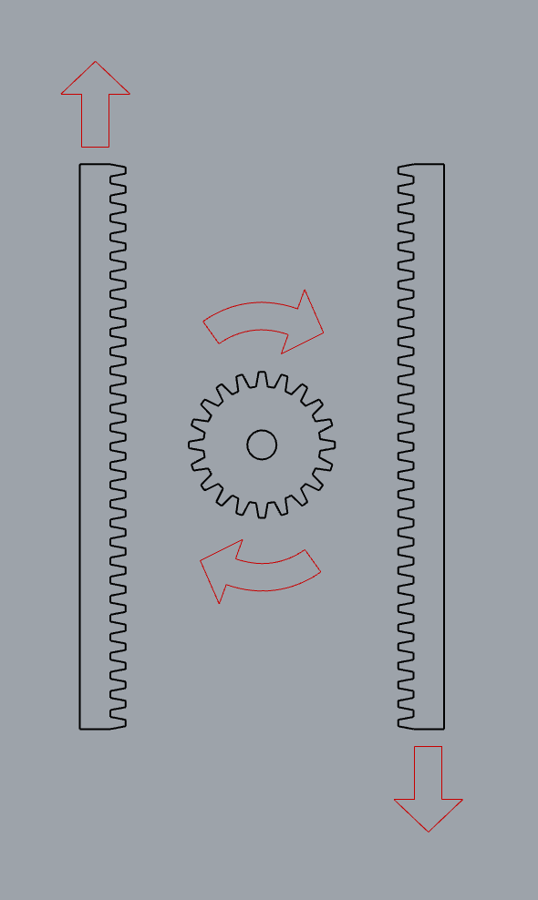
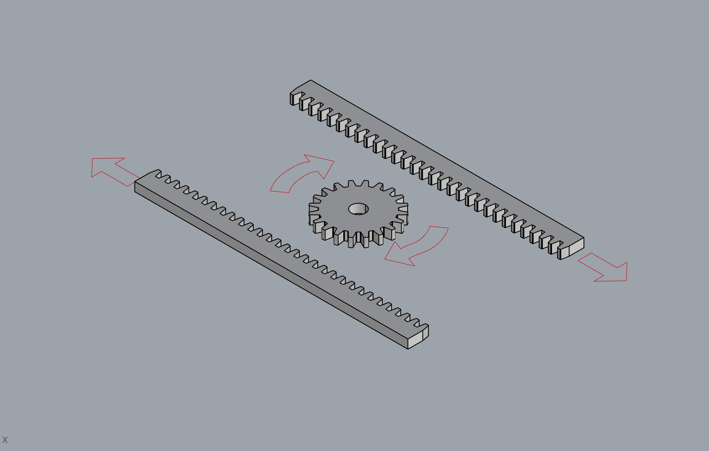

# Clase-13 (06/06/2024)

## Lectura Trabajos de Mis Compañeros

Me dedique al principio de la clase a revisar los trabajos de mis compañeros para ver si encuentro alguna información útil que pueda servir para mi proyecto. Revisando a la clase 10 de Mauricio Viveros, vi que el adquirio un motor paso a paso que podria servirme a mi, le hable y me conto como funcionaba y le pregunte que tan útil puede ser para mi. Luego de conversar me di cuenta que si me sirve, y además mi compañero me dio una mejor idea para el desarrollo de mi mecanismo. Esta idea la muestro a continuación:

Con esto optimizo la cantidad de mecanismos que tengo que hacer. En mi idea anterior tenia un total de 4 piños y 4 cremalleras, pero con esta nueva idea necesito 3 piñones y 3 cremalleras.

## Organización Clase 13

Luego de revisar los trabajos de mis compañeros organice como voy a trabajar en mi proyecto en el resto de la clase.

15:45 -> Revisión trabajos de compañeros
16:15 -> Organización de la clase
16:30 -> Corte laser de los mecanismos
18:00 -> Diseño nuevo mecanismo 

## Corte Laser

Luego de organizar la clase, fui a cortar los mecanismos con corte laser. Se muestran a continuación:

