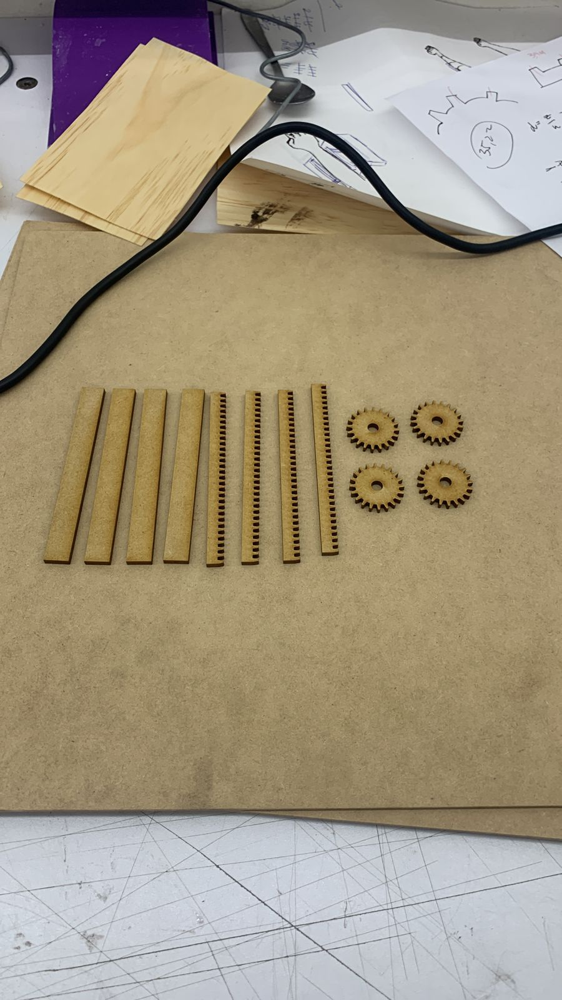

# Presentación

## ¿Qué es el proyecto?

El proyecto nace de una necesidad al momento de autotatuarse. Al tatuar, es necesario utilizar ambas manos, una para estirar la piel y otra para marcar el diseño escogido, pero cuando uno decide tatuarse a si mismo el brazo, se pierde la mano con la cual se tensa la piel, en mi caso, la izquierda. El tensado de la piel es fundamental, ya que esta acción permite que la aguja entre con mayor facilidad a la piel, y que se deposite de manera correcta la tinta en la dermis (segunda capa de la piel). 

Dado esta problemática, se me ha ocurrido crear un dispositivo que permita tensar la piel.

Los matareiales necesarios para el desarrollo del dispositivo son:

- Placa Arduino UNO
- Protoboard
- Cables
- Motor paso a paso
- Engranajes de fabricación propia
- Potenciometro 10K

El proceso de fabricación a grandes rasgos consiste en:

1. Bosquejar dispositivo
2. Probar engranajes
3. Crear código
4. Prototipar dispositivo

## Imagenes y Videos Explicativos

Imagenes del bosquejo del dispositivo

Imagenes y Videos de los engranajes 

https://github.com/MartinGonzalezUAI/dis145/assets/164402523/3774dbff-2dc2-4174-b46e-383c2dbd6b6a

## Línea Temporal

## Fuentes y Citas

## Conclusiones de investigación
