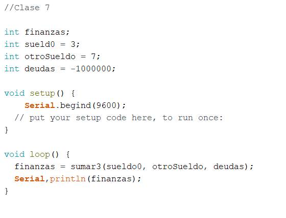
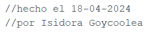
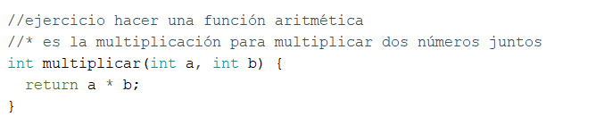
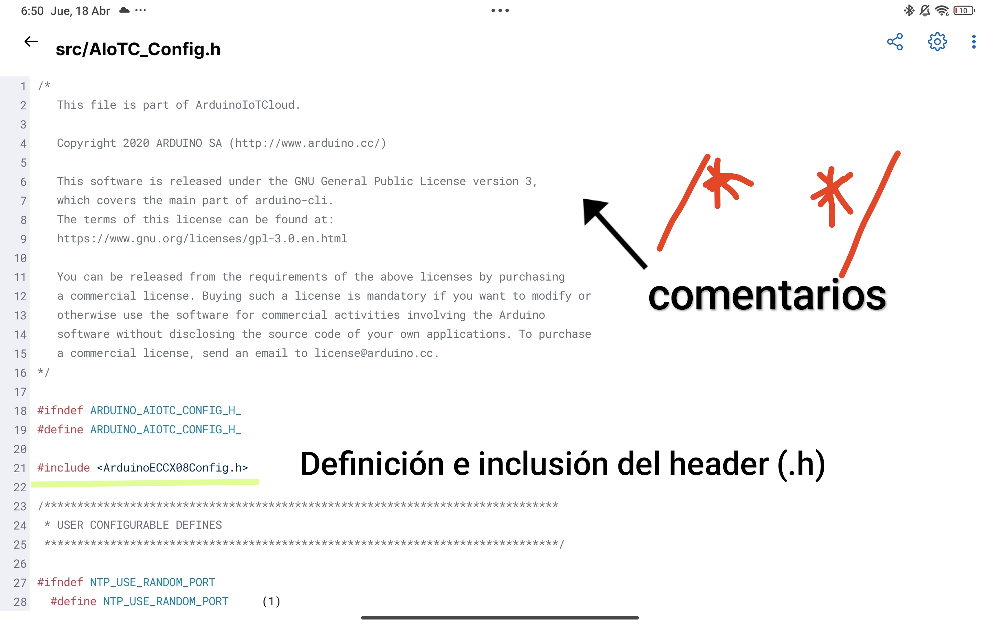

# Apuntes clase 07 :electric_plug:
*Jueves 18 de abril de 2024.*

# Códigos en arduíno :eye_speech_bubble:
Durante la clase aprendimos ciertos códigos específicos con distintas funciones, como:
- Void setup ()
- Void loop ()
- Void
- #include
- Int
- Auto: :...()
- this.
- if
- class
- boolean
- float
- int
- return
- else

***APUNTES CLASE*** :100:
  

# Actividad análisis código :arrow_down:
## Miembros del Grupo:
- ***Josefina Sánchez***
- ***Isidora Goycoolea:***
- ***Nicole Bechan:***
- ***Sebastián Millán:***

