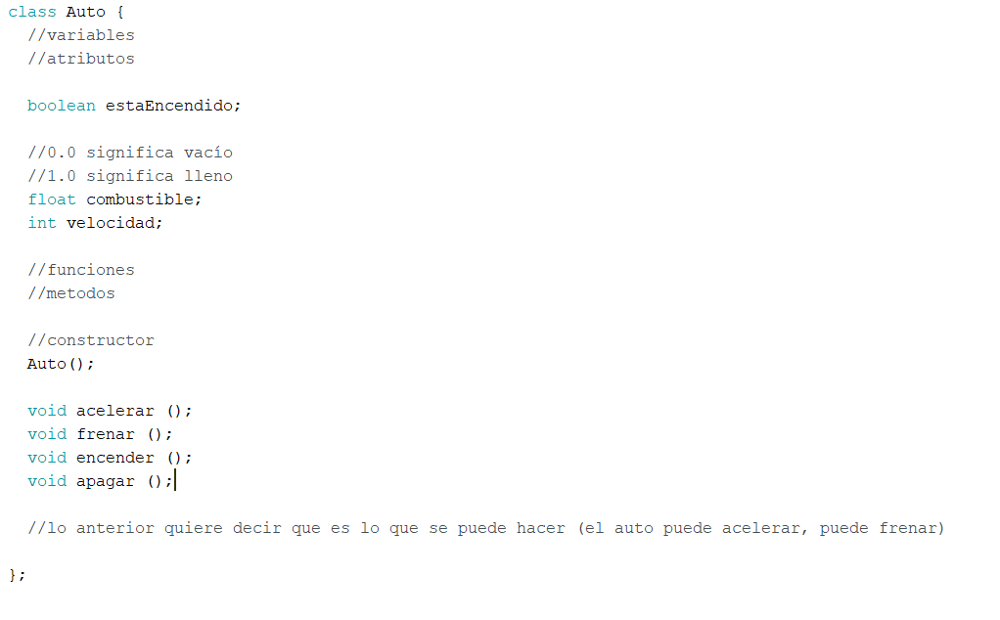
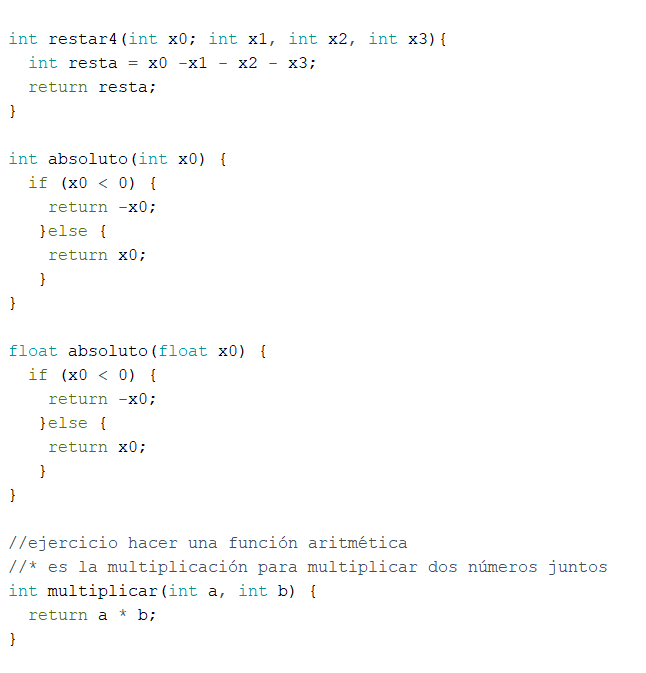

# Apuntes clase 07 :electric_plug:

_Jueves 18 de abril de 2024._

## Códigos en arduíno :eye_speech_bubble:

Durante la clase aprendimos ciertos códigos específicos con distintas funciones, como:

- void setup ()
- Void loop ()
- Void
- #include
- Int
- Auto: :...()
- this.
- if
- class
- boolean
- float
- int
- return
- else

**_APUNTES CLASE_** :100:

## Actividad análisis código :arrow_down:

## Miembros del Grupo

- **_Josefina Sánchez_**
- **_Isidora Goycoolea:_**
- **_Nicole Bechan:_**
- **_Sebastián Millán:_**

