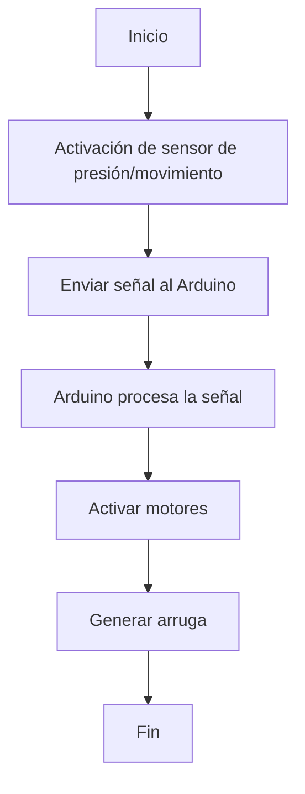
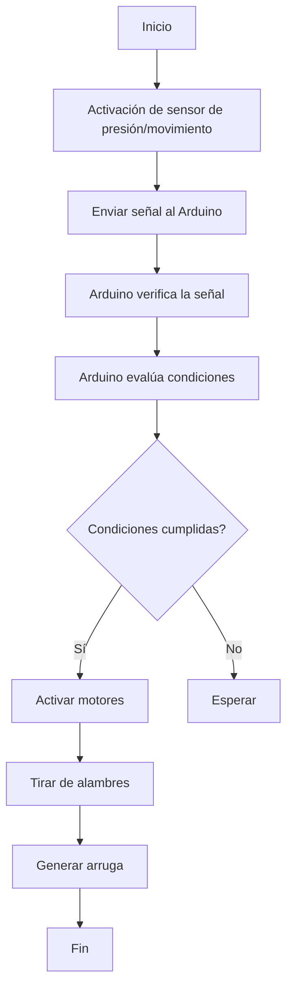

# Clase 9 :ledger:
### Caminos abandonados o callejones sin salida :no_entry:

1. **Uso de materiales:**
   - **Idea inicial:** Utilizar materiales como alambres y kotores para generar los movimientos.
   - **Problema encontrado:** No sé si iba a funcionar de la manera que quería.

2. **Implementación de alambres:**
   - **Idea inicial:** Poner alambres en la tela para que un motor pueda moverlos y crear la textura en la tela. 
   - **Problema encontrado:** El fomato sería muy poco preciso y no sabr´´´´ia cuál es la textura qye quisiera.

3. **Control manual de la textura:**
   - **Idea inicial:** Utilizar un sistema de control manual (por ejemplo, un dial o interruptores) para que el usuario pueda cambiar la textura de la prenda.
   - **Problema encontrado:** La solución resultaba poco práctica y limitaba la funcionalidad interactiva de la prenda, que idealmente debería responder automáticamente a estímulos externos.

### Diagramas de flujo

#### Diagrama 1: Flujo de funcionamiento básico



#### Diagrama 2: Flujo de funcionamiento detallado



### Borrador del código Arduino

```cpp
// Definición de pines y variables
const int sensorPin = 2; // Pin del sensor de presión/movimiento
const int motorPin = 9;  // Pin del motor
int sensorValue = 0;     // Valor leído del sensor

void setup() {
  // Configuración de pines
  pinMode(sensorPin, INPUT);
  pinMode(motorPin, OUTPUT);
  // Iniciar comunicación serial para depuración
  Serial.begin(9600);
}

void loop() {
  // Leer valor del sensor
  sensorValue = digitalRead(sensorPin);
  Serial.println(sensorValue); // Imprimir valor del sensor para depuración

  // Evaluar el valor del sensor
  if (sensorValue == HIGH) {
    // Activar motor para generar arruga
    digitalWrite(motorPin, HIGH);
    delay(1000); // Mantener el motor activado por 1 segundo
    digitalWrite(motorPin, LOW);
  } else {
    // Desactivar motor si el sensor no está activado
    digitalWrite(motorPin, LOW);
  }

  delay(100); // Esperar 100ms antes de la siguiente lectura
}
```

Este código implementa la configuración básica del sistema, donde el motor se activa cuando el sensor detecta presión o movimiento, y el `setup()` está completamente implementado. El flujo de funcionamiento está comentado dentro del código para mayor claridad.


# Qué quiero hacer :bangbang:
Prenda de vestir que pueda cambiar de textura de lisa a arrugada, con materiales como tela elástica o con cierta capacidad de contracción, junto con elementos que puedan generar la arruga, como alambres o hilos metálicos delgados. Proceso básico para lograrlo:

# Materiales necesarios:
Tela elástica o con capacidad de contracción.
Alambres o hilos metálicos delgados.
Arduino (por ejemplo, Arduino Uno).
Servomotores o motores paso a paso.
Batería o fuente de alimentación para los motores.
Cableado y conectores.
Resistencias y transistores (si es necesario para controlar los motores).

# Pasos a seguir:
Diseño de la prenda: Diseñar la prenda de vestir con la tela elástica, dejando espacios o bolsillos donde puedas colocar los alambres o hilos metálicos.

Instalación de los elementos: Poner los alambres o hilos metálicos dentro de la prenda en los lugares donde quiera que se genere la arruga. Fijarlos a la tela usando costuras u otros métodos de fijación.

Conexión de los motores: Conectar los motores a los alambres o hilos metálicos de manera que se puedan tirar de ellos para generar la arruga.

Programación de Arduino: Debo programar Arduino para controlar los motores de manera que puedan tirar de los alambres o hilos metálicos según sea necesario para generar la arruga. Utilizar sensores de presión o de movimiento para activar los motores en respuesta a ciertos estímulos.


#	:warning: FINALMENTE ESTA IDEA NO LA HARÉ, CAMBIÉ A OTRA IDEA.
