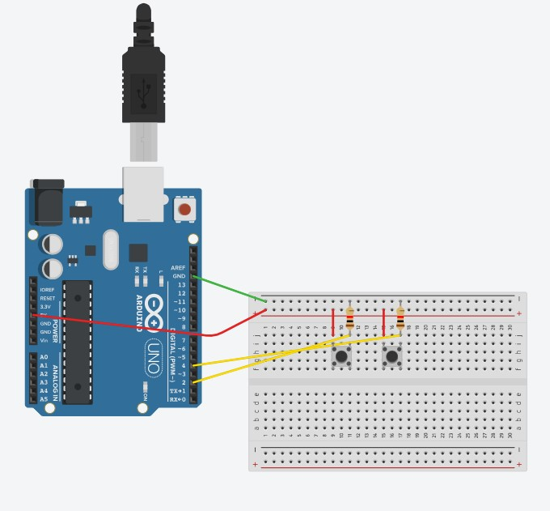

# PROYECTO MOUSE
_clase-04_

_2024-03-28_

_El objetivo del proyecto es simular mouse mediante arduino y componentes electronicos generando que este distinga entre click derecho, click izquierdo, doble click, y ademas, agregar una funcionalidad extra como el sensor de movimiento que tiene el mouse para que sea un mouse extendido especulativo_

_Por josefinasanchezr_

_Hecho con simulacion Tinkercard_

_Para Arduino UNO R3_

## ¿Qué aprendimos en el proceso?
_(Tips y datos)_

### Explicación cómo funciona un botón

## Funcionalidad Simple
_Que el mouse pueda distinguir entre click derecho, click izquierdo y doble click_

### Click Derecho - Click Izquierdo
El código permite que se distinga entre click derecho y click izquierdo imprimiendo en la consola según corresponde la respuesta de la accion.

**Simulación Tinkercad**

## Funcionalidad Extra

## Referencias y Fuentes

* Para inspirarme en el estilo del documento, la organizacion y formato de este me basé en los proyectos y README.md de @poly555 en GitHub
* Para realizar el codigo del ClikDerecho ClickIZquierdo me basé en los ejemplos que publica la documentacion de Arduino en https://docs.arduino.cc/?_gl=1*veav4*_ga*MTU3MTQ3Nzg3NS4xNzExNjU0NzY3*_ga_NEXN8H46L5*MTcxMTY1NDc2Ni4xLjAuMTcxMTY1NDc3NS4wLjAuMTY5MTY4MTc2Ng..*_fplc*SzllWERYQjNGeUwzMnEwaHAlMkJLNkpCUGRQSFhTcDdMYnI5Skp4a0dJeDBzeGh2dGx3YXI4NTNyTmJGejhGbTZwMHBqdVdWOG92UVVMcHVEclF3REdTaWZ0ZlpjWkUwUHBjWWVNU1ZtZnVVZnNEa1FjREE2eFFUSkJOOFJmWUElM0QlM0Q.
* 
