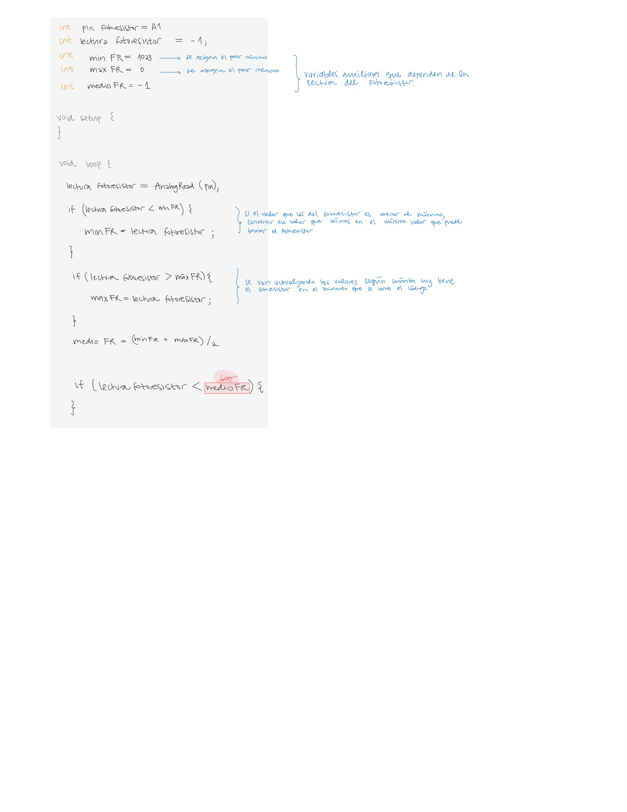
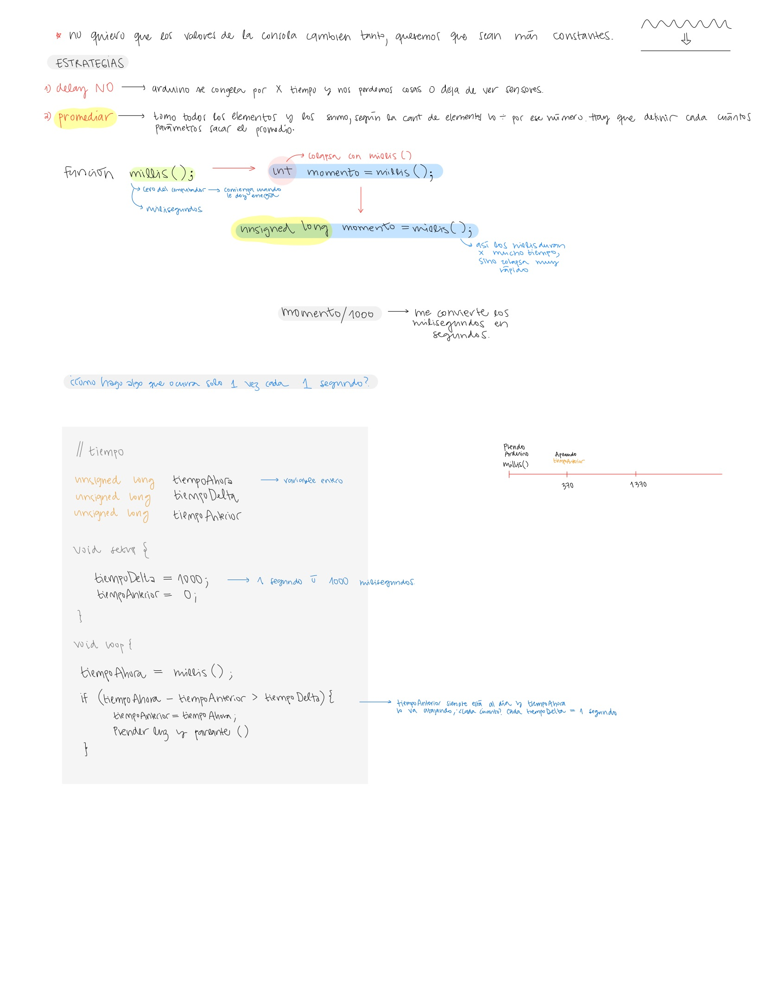
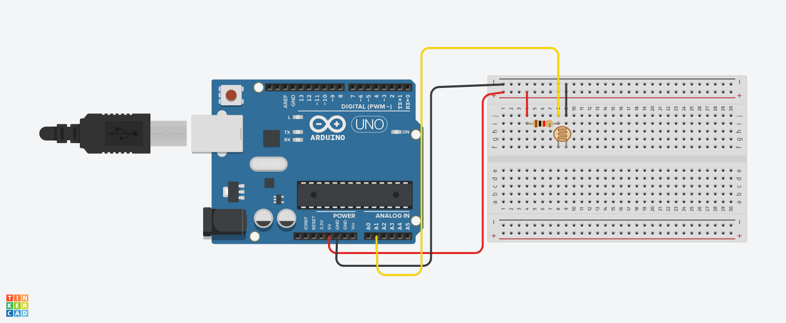

# clase-05

## Apuntes a mano

## Ejercicios prácticos

### Ejercicio 01

**Codigo:**

[Codigo Ejercicio 01](./codigo_ej01_clase05/codigo_ej01_clase05.ino)

**Simulacion en Tinkercard**

**Observaciones**
* No me funciono al principio porque me faltó poner en le codigo **Serial.print(9600) en el void setup()**
* Cuando le ponemos más luz al fotoresistor, se imprime "oscuridad" porque se imprimen numeros mayores a 600, por lo tanto el codigo debe ser **if (lecturaFR<600){ Serial.printIn("luz");}**
* El cambio de luz a oscuridad no se etsá haciendo justo en la mitad

### Ejercicio 0

**Codigo:**

[Codigo Ejercicio 02](./codigo_ej02_clase05/codigo_ej02_clase05.ino)

**Simulacion en Tinkercard**

**Observaciones**
* De la manera que estaba escrito el codigo, no se lograba identificar bien cuando cambaiaba el nuevo minimo del fotoresistor, por lo tanto, imprimimos en la consola en cada linea de la siguiente manera: **lectura: X; min: Y; max: Z**
* **lectura: X** ---> es la lectura del numero analogo del fotoresistor
* **min: Y** ---> es el minimo que corresponde a ese minuto (cuando cambia lectura), cuando agregamos o sacamos luz, este numero cambia y se iguala a **lectura: X**
* **max: Z** ---> no cambia, ya que no hay manera de superar el limite mayor que corresponde a 1017

