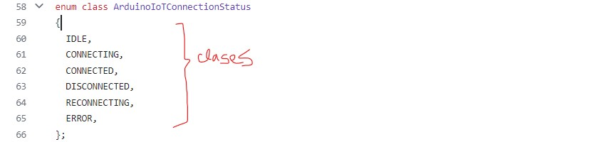

# clase-07

## APUNTES:

 Programacion hecha con objetos: es una estrategia de programacion.
 
 Librarys se escriben en archivos .h y .cpp

**.h**

 * es un tipo de archivo.
 * dice qué son las cosas que se pueden hacer, cómo se hace no va en este archivo.
 * las clases dentro del .h me dice que variables existen

**CLASS:**

* class: es una plantilla que permite crear algo que se llama un objeto
* las class se escriben con la primera letra en MAYUSCULA
* usan {} y terminan en };
* variables <- atributos
* funciones <- metodos
* diferencia entre variable y funcion: () <- las funciones tienen ()
* constructor <- es una funcion que se llama igual a la clase y no tiene tipo

**.cpp**

* #include ".h"<- copia y pega todo lo q esta en el archivo .h en el .cpp
* Nombre::Nombre <- dentro de la clase la funcion con el mismo nombre de la clase (constructor)
* Nombre::Nombre(){ AQUI SE PONE LO QUE VA A PASAR }
* 

## EJERCICIO ANALIZAR LIBRARY

Library ArduinoIoTCloud (https://github.com/arduino-libraries/ArduinoIoTCloud/blob/master/src/ArduinoIoTCloud.h)



## CODIGOS ARDUINO REALIZADOS EN CLASES

### aritmeticaAuto.ino

```cpp
int finanzas;
int sueldo0= 3;
int otroSueldo= 7;
int deudas= -1000000;

void setup() {

Serial.begin(9600);


}

void loop() {

finanzas = sumar3(sueldo0, otroSueldo, deudas);
Serial.println(finanzas);

}
```

### Auto.cpp

```cpp
 #include "Aunto.h"

// El auto comienza frenado y con el estanque de bencina lleno
// esta funcion es para que el auto comience frenado y con el estanque lleno
 Auto::Auto() {
  velocidad = 0;
  combustibe = 1.0;
  }

//Cada vez q el auto frena, su velocidad se combierte en 0
// esta funcion es para que el auto frene
 Auto::frenar(){
  velocidad = 0;
  }

//Cada vez q el auto acelere, su velocidad va a ir sumando de 1 en 1
// esta funcion es para que el auto vaya acelerando
 Auto::acelerar(){
  velocidad ++;
  }
}
```

### Auto.h

```cpp
class Auto {
  // VARIABLES
  // atributos

  // 0.0 es vacio y 1.0 lleno, el resto va con %
  float nivelCOmbustible; 
  // medida en km/h
  int velocidad;          

  // FUNCIONES
  // metodos 

  // constructor
  Auto();

  //todos los nombres en infinitivo
  void acelerar();
  void frenar(); 
  void encender();
  void apagar();
  
}; 
```

### sumaResta

```cpp
//CREANDO FUNCIONES 

// Fución para sumar 3 numeros 

// Existe una palabra de fantasia "sumar3" que le asigno 3 numeros exteros x0, x1, x2 y me arroja un resultado
int sumar3(int x0, int x1, int x2){   // nombre y parametros
   int suma = x0 + x1 + x2;           // acción 
   return suma;                       // expulsa hacia afuera: "suma"
}


// Fución para restar 4 numeros 

int restar4(int x0, int x1, int x2,int x3){
  int resta = x0 - x1 - x2 - x3;
  return resta;  
}

// Fución para sacar Valor Absoluto de un numero entero

int vAbsolutoInt(int x0){
  if (x0<0) {
    return -x0;
  }
  else{
    return x0;
  }
}

// Fución para sacar Valor Absoluto de un numero float

float vAbsolutoFloat(float x0){
  if (x0<0) {
    return -x0;
  }
  else{
    return x0;
  }
}


// Función para multiplicar 3 numeros

int mult3(int x0, int x1, int x2){
  int mult = x0 * x1 * x2;
  return mult;   
}
```

