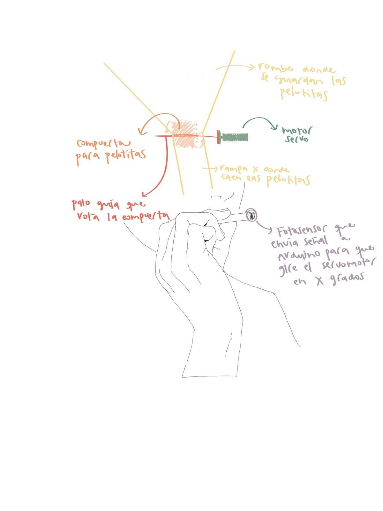
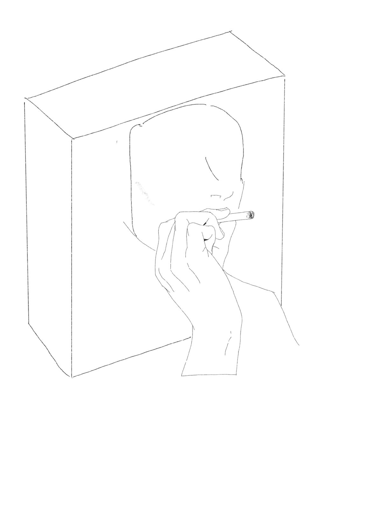
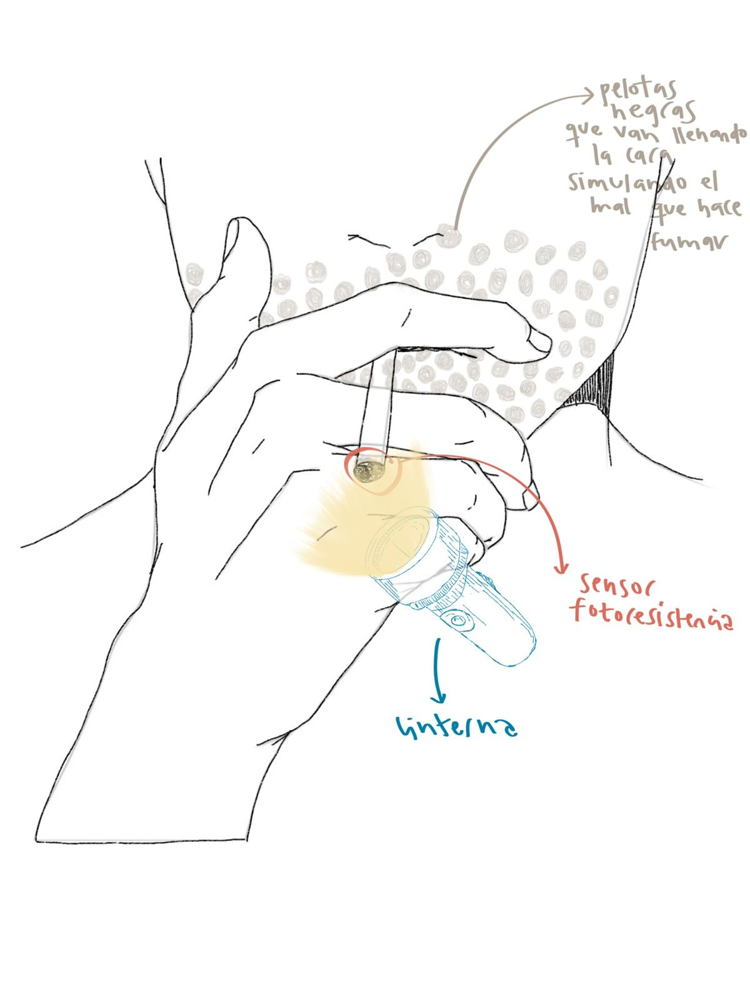
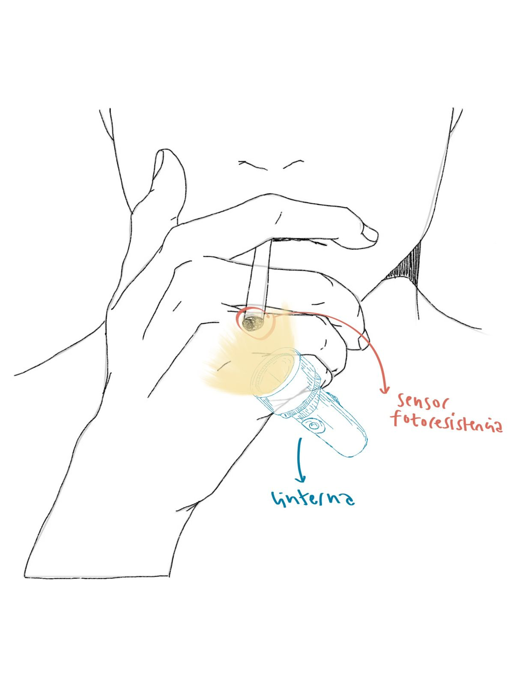
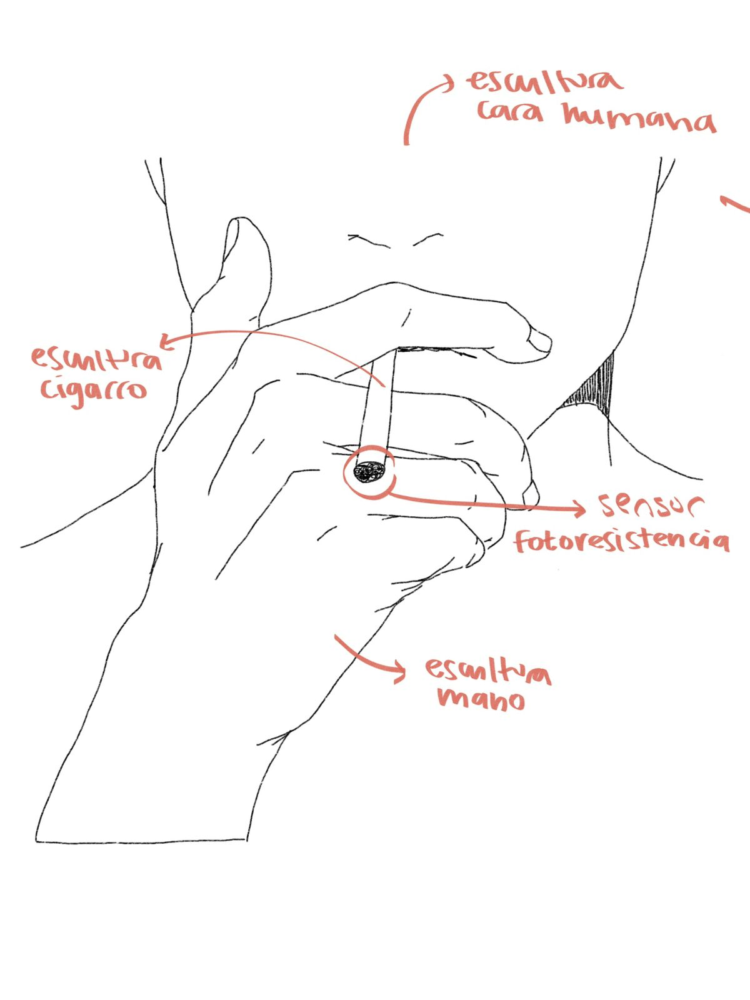

# clase-10

## CONCIENTIZACIÓN FUMADORES







**En que consiste?:** es una escultura interactiva que cuenta con una fotoresistencia en la punta del cigarro, la cual envia una señal a un Arduino UNO cuando percibe una X cantidad de luz y el Arduino envia otra señal a un servo motor para que se mueva y se abran las compuertas que retienen las pelotitas que caen dentro de la cara de la escultura. De esta manera, se refleja que mientras mas fumamos, mas daño nos hace. 

**Que necesito?:**
* 1 ServoMotor MG90S
* 1 Fotoresistencia (LDR) https://mcielectronics.cl/shop/product/sensor-de-luz-ldr-10499/
* 1 Arduino UNO
* 1 Protoboard
* 6 Cables Hembra Macho
* 6 Cables Macho Macho
* Resistencia
* Madera/Cartón
* Silicona
* Mostacillas/Bolitas livianas negras
* Pintura en Sray para terminaciones
* Cutter/Visturí

**Paso a Paso Creacion Estructura:**

**Código:**

**Referentes:**

https://www.vistronica.com/blog/post/Arduino-disipador-de-comida-para-tu-perro.html

* Código para sensor evasor de obstáculos:

```cpp
#include <Servo.h> // Incluí­mos la librerí­a para poder controlar el servo
Servo servoMotor; // Declaramos la variable para controlar el servo
int pinReceptor = A1; //Establecemos el pin a leer
int sensorVal; //Declaramos una variable para almacenar el valor de la lectura
boolean leerSensor = true;

void setup(){
Serial.begin(9600); // Abrimos comunicación Serial
servoMotor.attach(9);
servoMotor.write(150);
        }

void loop(){

servoMotor.attach(9);
sensorVal = analogRead(pinReceptor); //Guardamos la lectura del pin Analógico
Serial.println("Analoga:");
Serial.println(sensorVal); //Sacamos la lectura por serial
delay(500); //Pequeña pausa de medio segundo

if (sensorVal <= 45 && leerSensor) {
   if(leerSensor){
     leerSensor = false;
   }
   servoMotor.write(20); // Desplazamos a la posición 0º
   delay(2000);
   servoMotor.write(155); // Desplazamos a la posición 170º
   delay(2000);
   servoMotor.write(20); // Desplazamos a la posición 0º
   delay(2000);
   servoMotor.write(150); // Desplazamos a la posición 170º
   delay(2000);
   }
}

```

https://www.youtube.com/watch?v=ejqWLsCPYpY

* Código para controlar rotacion de servomotor segun cantidad de luz que le llega al sensor:

```cpp
#include <Servo.h> 
Servo myservo;    

//Inicializo variable que es la posicion de mi servomotor
int pos = 0;


void setup(){

//Iniciamos monitor serial
   Serial.begin(9600); 
//Asignamios pin 9 para controlar el servomotor
   myservo.attach(9);
}


void loop(){

//Declaramos la variable ldr que lee el valor del pin analogico A0 donde esta conectado el sensor
  int ldr= analogRead(A0);

//Se calcula la posicion del servo
  pos=(1023-ldr)/4;

//Imprime la posicion en el monitor serial
  Serial.println(pos);     

//Posicion se escribe sobre el servo                          
  myservo.write(pos);

//Delay para q cambie de posicion
  delay(15);
}
```

https://www.youtube.com/watch?v=ejqWLsCPYpY
