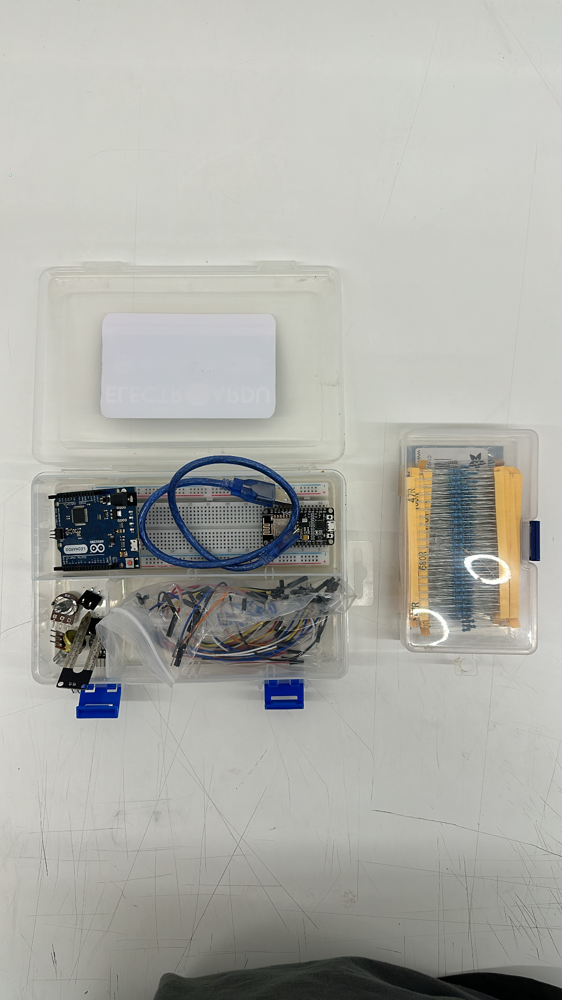

asjhbdah



* Arduino UNO R3
* Protoboard
* Cable Dupont
* Cables USB
* Resistencias
* Sensor de color
* Botones y potenciometro


```cpp
// para encontrar el caracter acento al reves
// buscar backtick
void setup (){
  int x=0;
}   
