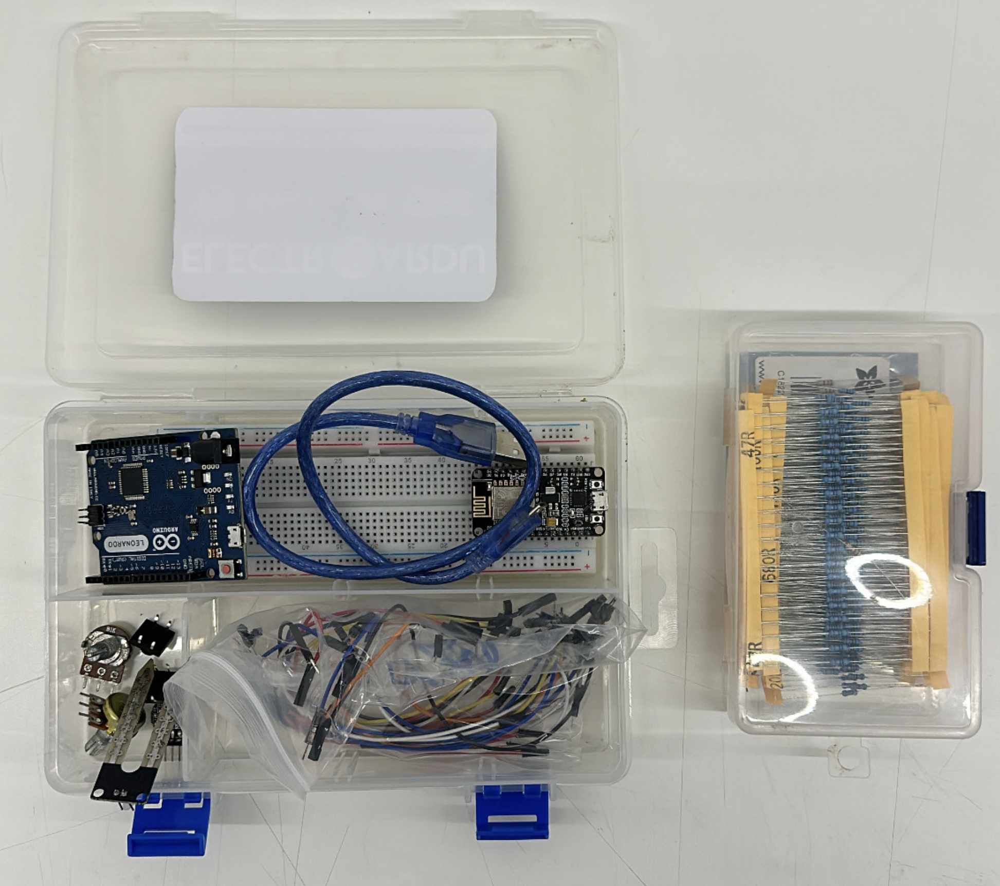

# ENTREGA FINAL

### Recorrido y progreso primeras clases:
Durante este curso comenzamos inicialmente con la introducción de todo lo que es GitHub y MarkDown, en donde en primer lugar y de forma particular, conocí el sitio web y su metodología de trabajo la cual anteriormente
desconocía por completo. Comencé por aprender poco a poco acerca de la forma de redactar, navegar por el curso y por cada uno de los usuarios (estudiantes) que son parte de este, lo cual es una buena forma de resolver 
dudas, aprender o inspirarse para llevar a cabo nuevas ideas o proyectos según sea el caso.

En conjunto con lo anterior, llevamos a la clase un kit de arduino en donde se nos introdujo el tema y nos dieron a conocer de forma breve su lenguaje (mediante el software ''Arduino'') así como el formato de trabajo de estos componentes, así también 
cómo pueden ser y han sido el inicio de grandes proyectos en todo el mundo. 

### Desafíos grupales en arduino:  

A modo de desafío y comenzar a emplear tanto las herramientas como los conocimientos adquiridos, fue que de forma grupal comenzamos realizando un código en el software de Arduino, el cuál debía desarrollarse paso a paso para
responder a ciertas funciones que le fuesemos a designar, como por ejemplo que mediante el software, al momento de presionar uno de los botones sea este el izquierdo o derecho, se mencionase en la consola de salida ''Click
izquierdo'' o ''doble click izquierdo''. Empleamos la definición de cada botón del mouse; asignándole un valor digital de nuestra placa Arduino UNO a cada botón del mouse, luego almacenando sus estados 
iniciales y posteriormente desarrollamos el código correspondiente en Void Setup y Void Loop, programando esto de acuerdo al objetivo explicado anteriormente.

-> video

Luego del desafío mencionado, continuamos con otros dos de forma grupal, el primero constaba de crear un código que permitiera encender un led según el valor que captara un fotoresisto y el segundo de que se encendiera un
led si se presiona dos veces un botón.
En el primer caso, luego de definir los valores digitales del led y los análogos del fotoresistor, desarrollar el código correspondiente para Void Setup y Void Loop, se asignaron mensajes de respuesta según lo captado por
el fotoresistor, como por ejemplo: ''Luz'', ''Oscuridad'', ''Máximo es'' y ''Mínimo es'', funcionó con éxito.
Para el segundo caso, no resultó igual de exitoso que el anterior ya que luego de realizar todos los pasos correspondientes del código, el led no funcionaba al presionar dos veces seguidas el boton.
Destaco que es de gran ayuda trabajar con personas que tienen habilidades según cada contexto, ya que se aprende bastante.

Conocimos diferentes herramientas cómo: MidiBus y Processing; librería de códigos arduino, trabajamos con uno como grupo el cuál consistió en realizar cambios de colores en una ventana pequeña del software de Arduino (Se abría dentro del mismo programa).

### Proyecto personal:

Luego de trabajar con el programa de arduino, poco a poco comenzamos a conocer nuevas variables para emplear códigos en arduino, en lo personal registré ''float division'' y ''int multiplication'' los cuales desconocía y
de forma simultánea analizamos referentes y proyectos como: Laureen Lee McCarthy y su proyecto llamado ''Anti-Daydreaming Scarf'' o también ''Happiness Hat''.

Inicialmente pensé en realizar un proyecto que tuviera relación con la salud, en donde utilicé los siguiente referentes:
https://www.ucsf.edu/news/2020/12/419271/wearable-sensor-may-signal-youre-developing-covid-19-even-if-your-symptoms-are
https://github.com/WorldFamousElectronics/PulseSensor_Amped_Arduino

Finalmente, fue descartado por completo ya que preferí optar por algo que estuviera relacionado con mis gustos y preferencias, que es el tema automotriz. Para esto pensé en una problematica, la cual trataba sobre el tema del
encandilamiento producido producto de las luces en vehículos que conducen detrás de otro. 

Inicialmente, pensé en hacer el proyecto de la forma más accequible posible pero tuve que descartar la idea en base a como era originalmente, esto dado que debía conseguir materiales por Aliexpress, como por ejemplo, una pantalla PDLC y el tiempo de demora era demasiado por lo que no alcanzaría a realizar el proyecto en el plazo dado. 

Acotación: La pantalla PDLC mencionada, tiene la particularidad de dejar de forma opaca un vidrio transparente, la idea era que ésta atenuase la luz mediante la captación de esta por un fotoresistor, según una intensidad determinada.

A modo de acercarme en la mayor medida posible al concepto de lo que quería realizar, cambié el proyecto por un sistema mecánico el cual puede abrir y cerrar una cortina o persiana, esto también podría resultarme más fácil dado que como sección habían más proyectos mecánicos por lo que podríamos apoyarnos entre todos.
 
Los referentes en los que me basé fueron los siguientes: 
https://www.youtube.com/watch?v=y3mY5tSrZ9Q
https://www.circuits-diy.com/stepper-motor-using-l298n-driver-arduino-tutorial/ 
https://mcielectronics.cl/shop/product/modulo-joystick-para-arduino/ 
https://www.youtube.com/watch?app=desktop&v=locew337i4M

-> Foto referencial proyecto

Requería de los siguientes materiales:

- Arduino UNO.
- Motor paso a paso.
- Joystick.
- Cables.
- Driver L298N.
- Software.
- Confeccion 3D Base.
- Cable USB.
- Batería.

Reuní casi todos los materiales necesarios y comencé desarrollando el código basándome en los siguientes referentes: 
https://gist.github.com/renatoargh/818874b8d1d37b5c2abc.
https://www.youtube.com/watch?v=nfhIIkJ-Ze0

---> Colocar código.

Si bien tenía el código desarollado, todas las conexiones físicas listas, menos una: la batería, material vital para poner a prueba el proyecto.

Mientras intentaba conseguir una batería de acuerdo con los requerimientos del Motor (12V y 1.7 Ah), intenté hacerlo con baterías de 9V, dos pilas unidas tipo AA, pero ninguna opción me sirvió, el motor no hacía absolutamente nada.

Terminé por conseguir una batería de 12V y 32 Ah, un amperaje muy superior al requerido por el motor (1.7 Ah), fue por esto que antes de utilizarla investigué sobre posibles consecuencias a modo de prevención y luego de conversar con una persona que ya tenía conocimiento previo acerca de estos motores y alimentación el cual tiene una tienda de electrónica, me mencionó que no tendría problemas. Realicé la prueba, y a modo de prueba lo hice con un computador que ya no usaba y no con el que utilizo a diario; conecté la batería y encendió tanto el driver L298N como el motor paso a paso.

Si bien encienden los componentes, tengo un problema ya que al inclinar el joystick de lado a lado el motor paso a paso se mueve muy poco y se mantiene vibrando, buscando referencias del problema me encontré con casos similares, ya he revisado con un voltímetro el motor para verificar que esté en optimas condiciones y lo está, así tambien la batería externa y las conexiones pero el código posiblemente no ya que al modificar los valores
del delay en Void loop el comportamiento del eje del motor varía, es probable que el valor que yo le indico no sea el indicado y ese sea el problema.

Referentes con el mismo problema: https://www.youtube.com/watch?v=WoPYHDA32Zk y https://www.youtube.com/watch?v=VdkpPHIioUo&t=206s .

-> Último código.
-> Imágen
-> Video

