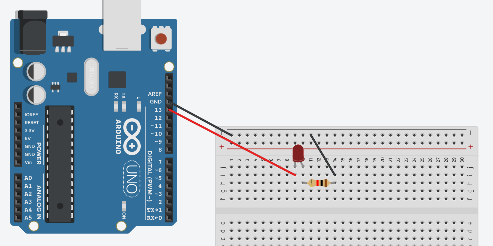
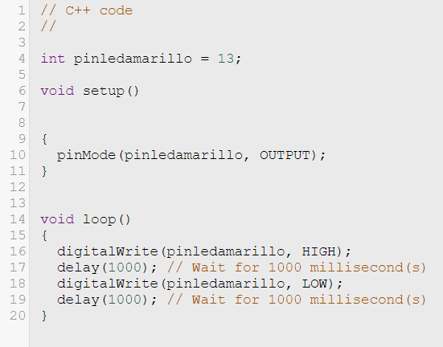
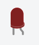
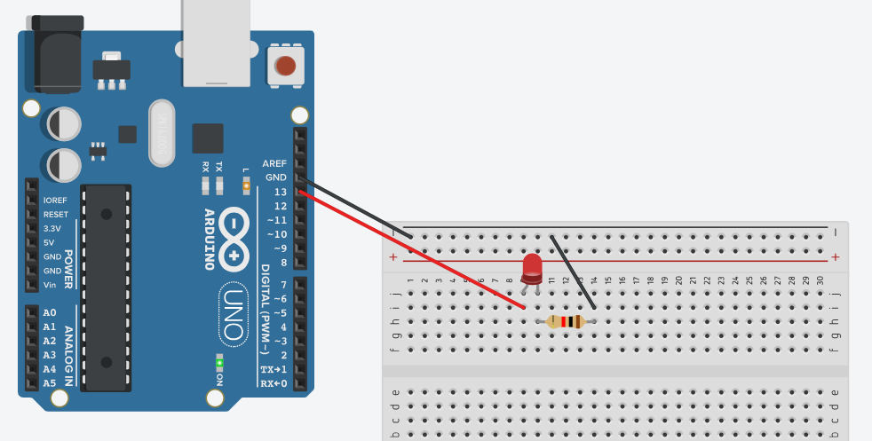
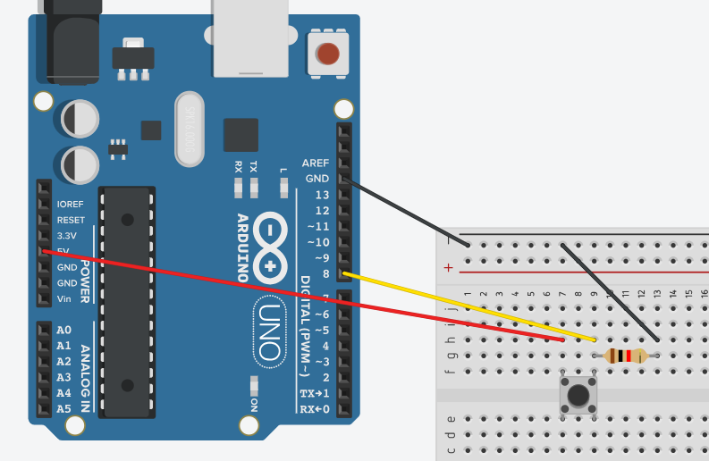
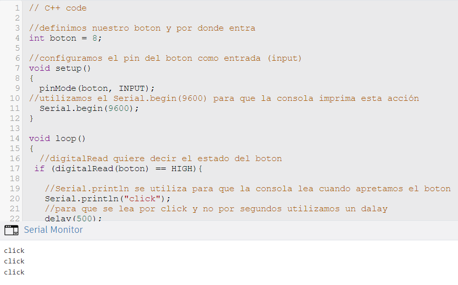

# clase-04

Durante esta clase estaremos trabajando con Arduino Uno R3,
Dado que no traje mi arduino, me desarrollaré en la aplicación Tinkercat la cual simula un arduino.

Buscamos comenzar desde algo simple hacia algo un poco mas complicado por lo que el primer acercamiento con arduino fue prender una luz Led y apagarla.

Para esto utilizamos cables (negros para ground y rojos para poder), una resistencia de 1K(om), ardiuno, y una Led.

En este caso utilizamos los puertos 13 (conectado al led) y ground (desde la resistencia).

creamos el circuito y su codigo en el cual se define el LED como pinledamarillo en output y definimos tambien desde donde sale (puerto 13)
luego, en el codigo escribimos el "void loop (la acción) en donde se describe cuando se prende la luz y cuando se apaga (high y low con sus respectivos tiempos cada uno)

por alguna razón el led no se prendia cuando lanzabamos el codigo.
dado esto vizualizamos el codigo y el circuito denuevo hasta darnos cuenta de que el led estaba del lado correcto ya que estos tiene una pata corta (negativo) y una pata larga (positivo).

ya habiendo cambiado el led de lado dimos play a la simulación y esta funcionó como se puede ver en la imagen.

ya teniendo el ejercicio de la led listo nos pusimos a indagar en algo mas complicado e hicimos un circuito el cual tiene como objetivo que el computador capte cuando un boton este apretado o no.

para esto comenzamos creando el circuito donde utilizamos un arduino, una resistencia, un botón y por ultimo cables negros (para ground), rojos (para el poder) y amarillos (para definir el boton).

En este caso, luego de crear el circuito comenzamos a programar el sistema haciendo que el arduino capte cuando apretemos el botón y se escriba en la consola "click" cuando la accion ocurra.
dentro de este codigo esta todo explicado en los comentarios que se encuentran despues del "//"

Ya con el ejercicio del boton listo, nos avanzamos hacia el ultimo paso el cual sería crear un codigo y circuito con dos botones donde se capte que boton se esta apretando. 
