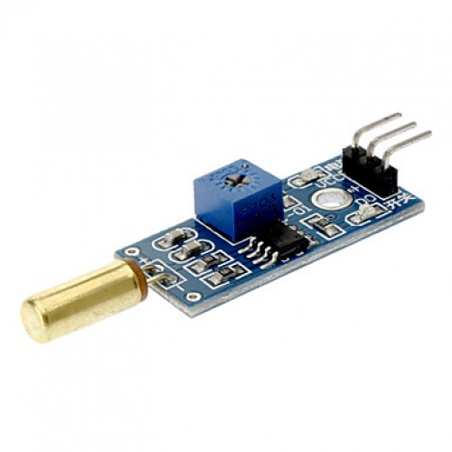
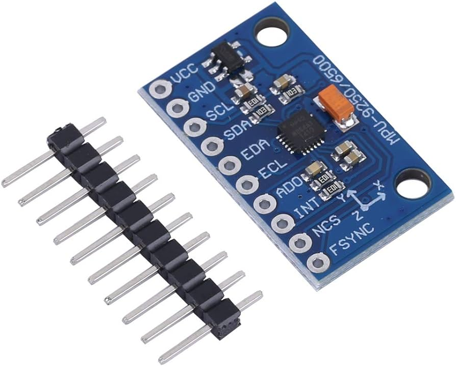

# clase-10

Durante la clase n07 decidimos cual seria nuestro proyecto final, pero, no investigamos como se desarrollaría este mismo.
Por esto, durante la clase de dia de hoy buscamos cuales podrian ser las posibilidades que tenemos en mano.

Antes de esto explicamos mas detalladamente el objetivo del proyecto.
La idea que tenemos en mente es crear un señalizador que ayude a la gente que se moviliza en bicicleta y que se le hace dificil sacar las manos del volante
ya que no tienen buen equilibrio o se le dificulta bastante. Teniendo en cuenta esto vamos a necesitar la ayuda de algún sensor de movimiento que iría pegado al casco y dependiendo de la inclinacion que se utiliza señalizaria de un lado u de otro.

Teniamos claro el proyecto pero no los sensores que se utilizarán, por lo mismo, con la ayuda del profesor indagamos en la web.

Primeramente encontramos un sensor tilt el cual manda una señal segun su inclinación.

el problema con esto fue que este sensor solamente reconoce un umbral de inclinación, por lo mismo no podriamos enviar la señal para que señalice en los dos sentidos.

siguiendo con la investigacion por la web encontramos un dispositivo llamado giroscopo el cual mide el cambio en el angulo rotacional.
Este sensor (giroscopio y acelerometro mpu-6050) puede medir el angulo en 3 ejes (x, y, z) pero nosotros solamente necesitamos un eje así que tendriammos el trabajo mucho mas simple. 

Teniendo este sensor podriamos programar que si este capta un angulo -x (izquierda) se prenda una cantidad de luces led las cuales hagan una figura de flecha hacia la izquierda y si este capta un angulo +x (derecha) se prenda una flecha de leds hacia el lado opuesto al anterior.

