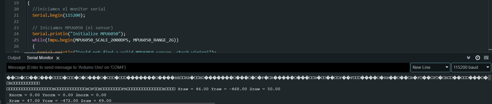
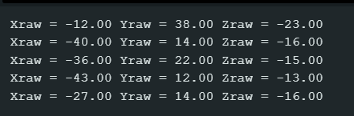
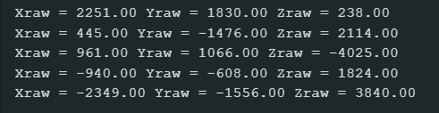
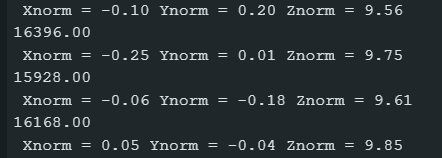
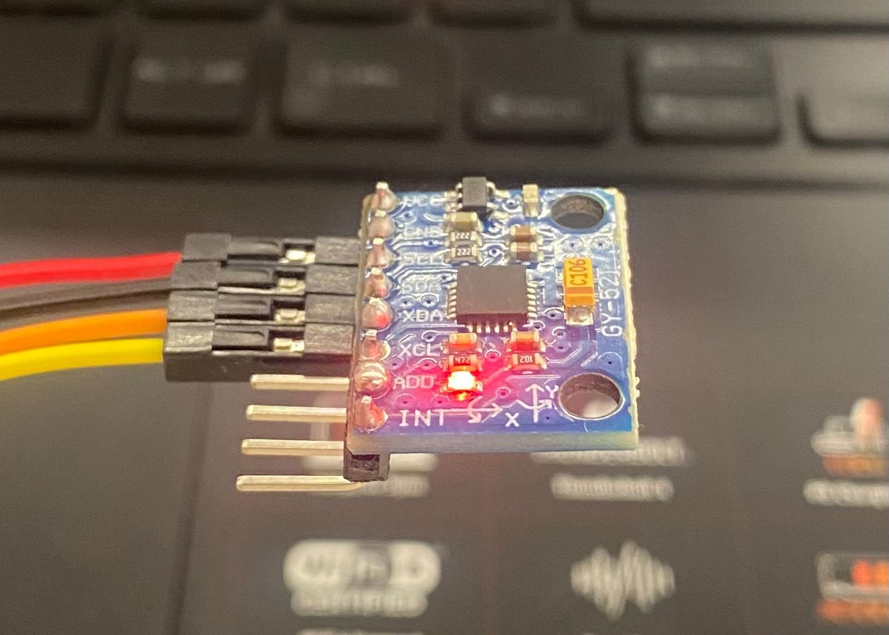
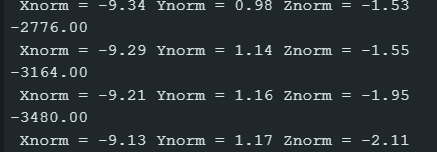
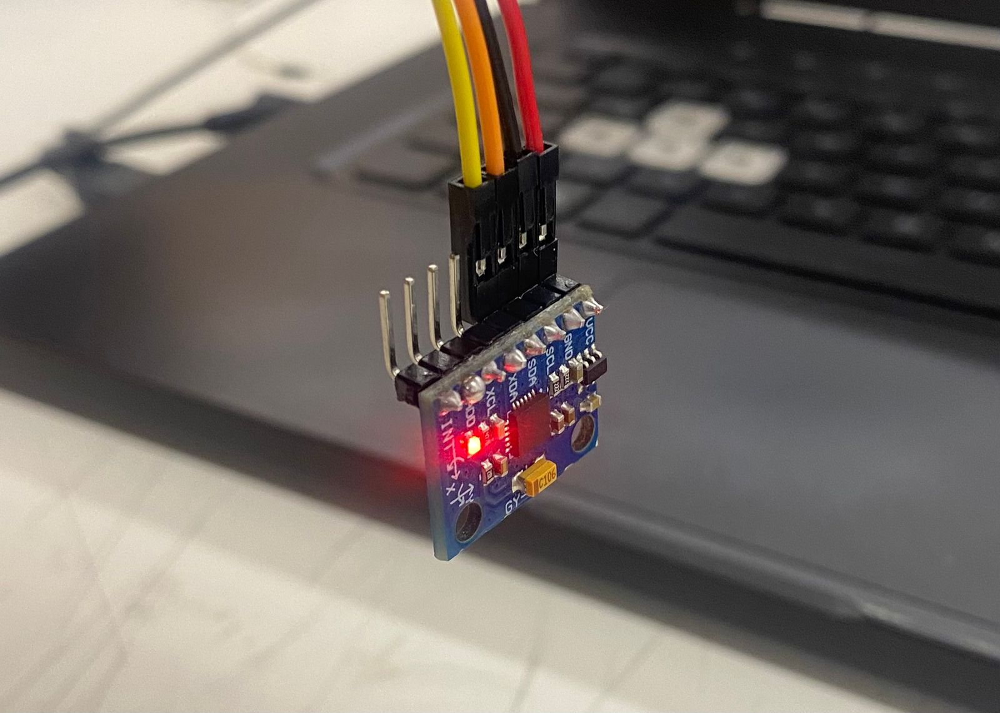
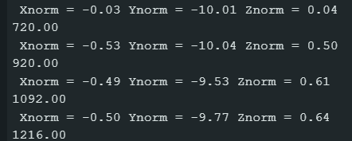
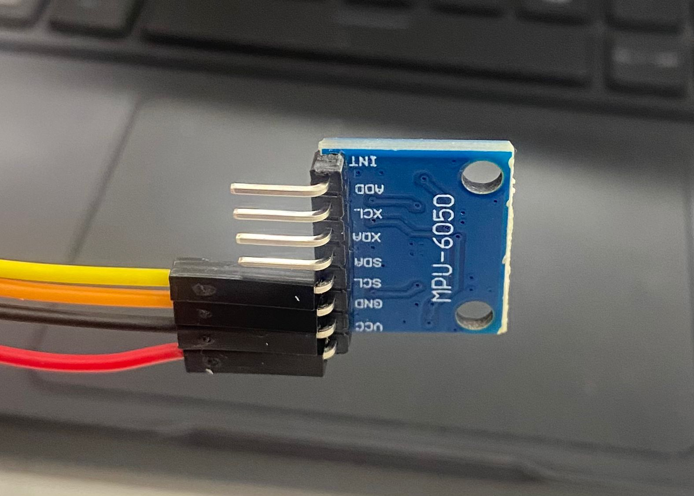

# clase-12

durante esta clase nos metimos al 100% en comenzar y analizar el codigo que necesitaremos para el proyecto
la clase anterior encontramos un muy buen ejemplo para comenzar a utilizar el sensor de giroscopio y accelerometro
ejemplo: https://www.instructables.com/MPU-6050-Tutorial-How-to-Program-MPU-6050-With-Ard/

en este nos muestran como conectar el sensor y nos dan varios ejemplos 
nosotros comenzamos con el ejemplo de *giroscopio* en donde simplemente utilizamos el sensor el cual nos manda señales al monitor serial del computador

analizamos el codigo que nos dieron
para utilizar el codigo tuvimos que descargar una libreria nueva "mpu6050.h"
luego vimos a la rapida cada linea pero con conciencia y aprendimos para que servia cada una
aparte de los problemas que tuvimos conectado el arduino al computador para poder enviar el codigo a este y utilizarlo nos vimos con el problema de que el monitor serial nos daba valores muy extraños 



nos dimos cuenta de que en el codigo al iniciar el monitor serial nos pedian que este leyera en un tipo de signo (115200) por lo que nosotros teniamos arduino en una opcion diferente
no fue muy terrible ya que cambiamos rapidamente a 115600 baud y nos comenzó a arrojar numeros

luego de tener el codigo funcionando, nos dimos cuenta de que los numeros no cambiaban acorde a lo que queriamos
cuando dejabamos el sensor los numeros quedaban bajos y cuando lo moviamos estos se alzaban y se hacian mucho mayores pero al dejar el sensor quieto volvian a numeros bajos

    

teniendo esto claro nos dimos cuenta de que este no utilizaba los angulos sino que solo el movimiento
por lo mismo dejamos el codigo de giroscopio de un lado ya que no nos sirve y buscamos un ejemplo de *acelerometro* el cual viene incluido en el mismo sensor

codigo analizado "ejemplo simple de *acelerometro*"
```cpp

//este ejemplo lo sacamos del github de Jarzebski

/*
    MPU6050 Triple Axis Gyroscope & Accelerometer. Simple Accelerometer Example.
    Read more: http://www.jarzebski.pl/arduino/czujniki-i-sensory/3-osiowy-zyroskop-i-akcelerometr-mpu6050.html
    GIT: https://github.com/jarzebski/Arduino-MPU6050
    Web: http://www.jarzebski.pl
    (c) 2014 by Korneliusz Jarzebski
*/


//incluimos estas dos librerias de las cuales mpu6050 la tuvimos que instalar mientras que Wire viene con arduino
#include <Wire.h>
#include <MPU6050.h>

MPU6050 mpu;

void setup() 
{

  //iniciamos el monitor y en cuantos baud se lee (115200)
  Serial.begin(115200);

//iniciamos el sensor mpu6050
  Serial.println("Initialize MPU6050");
  while(!mpu.begin(MPU6050_SCALE_2000DPS, MPU6050_RANGE_2G))
  {
    Serial.println("Could not find a valid MPU6050 sensor, check wiring!");
    delay(500);
  }


//estas lineas se utilizan para orientar el sensor, por ejemplo si lo queremos utilziar vertical u horizontal
//por el momento no necesitamos cambiar el offset, podemos utilizar el predeterminado

  // If you want, you can set accelerometer offsets
  // mpu.setAccelOffsetX();
  // mpu.setAccelOffsetY();
  // mpu.setAccelOffsetZ();
  


//***en el ejemplo recomiendan no tocar este sector***
  checkSettings();
}

void checkSettings()
{
  Serial.println();
  
  Serial.print(" * Sleep Mode:            ");
  Serial.println(mpu.getSleepEnabled() ? "Enabled" : "Disabled");
  
  Serial.print(" * Clock Source:          ");
  switch(mpu.getClockSource())
  {
    case MPU6050_CLOCK_KEEP_RESET:     Serial.println("Stops the clock and keeps the timing generator in reset"); break;
    case MPU6050_CLOCK_EXTERNAL_19MHZ: Serial.println("PLL with external 19.2MHz reference"); break;
    case MPU6050_CLOCK_EXTERNAL_32KHZ: Serial.println("PLL with external 32.768kHz reference"); break;
    case MPU6050_CLOCK_PLL_ZGYRO:      Serial.println("PLL with Z axis gyroscope reference"); break;
    case MPU6050_CLOCK_PLL_YGYRO:      Serial.println("PLL with Y axis gyroscope reference"); break;
    case MPU6050_CLOCK_PLL_XGYRO:      Serial.println("PLL with X axis gyroscope reference"); break;
    case MPU6050_CLOCK_INTERNAL_8MHZ:  Serial.println("Internal 8MHz oscillator"); break;
  }
  
  Serial.print(" * Accelerometer:         ");
  switch(mpu.getRange())
  {
    case MPU6050_RANGE_16G:            Serial.println("+/- 16 g"); break;
    case MPU6050_RANGE_8G:             Serial.println("+/- 8 g"); break;
    case MPU6050_RANGE_4G:             Serial.println("+/- 4 g"); break;
    case MPU6050_RANGE_2G:             Serial.println("+/- 2 g"); break;
  }  

  Serial.print(" * Accelerometer offsets: ");
  Serial.print(mpu.getAccelOffsetX());
  Serial.print(" / ");
  Serial.print(mpu.getAccelOffsetY());
  Serial.print(" / ");
  Serial.println(mpu.getAccelOffsetZ());
  
  Serial.println();
}

//***fin del sector***

void loop()
{

  //en este caso hay dos variables de numeros
  //Raw el cual nos da un numero mas grande y mucho mas preciso
  //normalize el cual nos da un numero de 1 unidad menos preciso pero mas facil de leer
  Vector rawAccel = mpu.readRawAccel();
  Vector normAccel = mpu.readNormalizeAccel();

//en estas lineas se le pide al monitor serial que nos de un numero que represente los axis (x, y, z)
  Serial.println(rawAccel.ZAxis);
  Serial.print(" Xnorm = ");
  Serial.print(normAccel.XAxis);
  Serial.print(" Ynorm = ");
  Serial.print(normAccel.YAxis);
  Serial.print(" Znorm = ");
  Serial.println(normAccel.ZAxis);
  
  //podemos decidir que tan rapido el monitor serial nos entrega los numeros de axis
  delay(1000);
}

```

ya teniendo este codigo en el cual explicamos con //comentarios, lo que hace cada linea
pusimos a funcionar el codigo nuevo con el sensor y nos dimos cuenta de que encontramos lo que necesitabamos

el monitor serial ahora nos arroja numeros que cambian segun el angulo dell sensor

   

   

   
