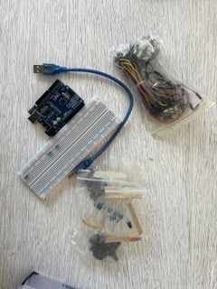

# clase-03

Estamos dentro



- Arduino UNO R3
- Cables dupont
- protoboard
- resistencias
- cable usb
- botones
- potenciometro

```cpp
// para encontrar el caracter acento al reves
// buscar backtick
void setup() {
  int x=0;
}
```

Trabaje con pedrolegarraga1 <https://github.com/pedrolegarraga1>
