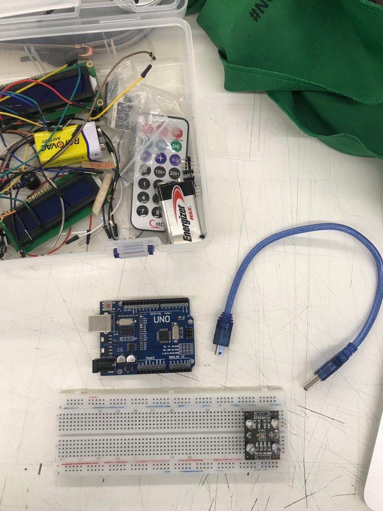

foto de materiales



* Arduino UNO R3
* Botones
* Cables dupont
* Cable USB
* Computador
* Potenciómetro
* Protoboard
* Resistencias
* Sensor de color


```cpp
// para encontrar el caracter acento al revés
// buscar backtick
void setup(): {
  (int x =  0);
}
```
