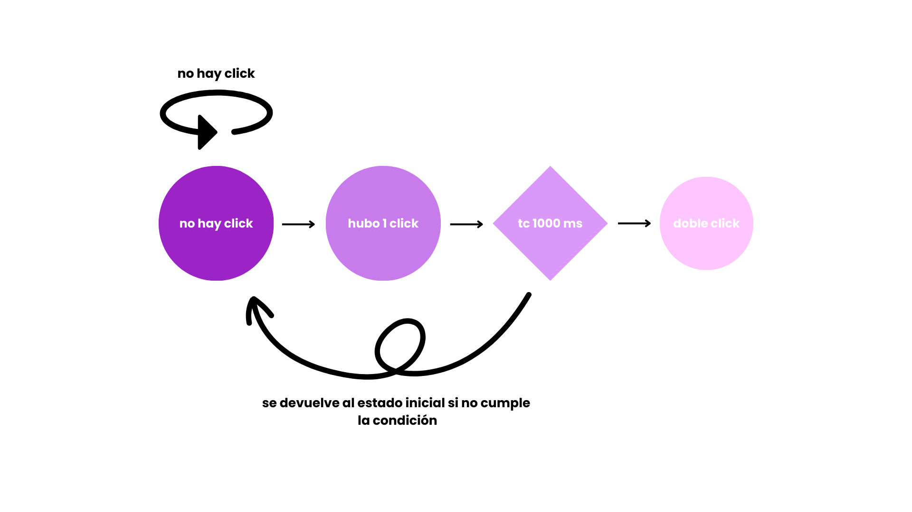

# clase-05

# Apuntes clase 04 de abril 2024

_Conectar un fotorreceptor_

Int (las entradas analog in de Arduino, permite variables de este tipo) que varían entre 0 y 1023 bits. Después se pueden hacer condiciones dependiendo si la variable establecida tiene un valor mayor a x bits.
El float permite muchos errores porque termina realizando aproximaciones que pueden entregar distintos resultados cada vez que se ejecute.

Las entradas analógicas no se configuran, a diferencia de las digitales que son mutantes y pueden convertirse en entrada o salida, dependiendo de la configuración.

**Ejemplo de código**

```cpp
int pinFR = A1;
int lecturaFR = -1;

void setup() {
}

void loop() {
  lecturaFR = analogRead(pinFR);
  Serial.println(lecturaFR);
  if (lecturaFR > 600) { // el 600 entra dentro de un contexto particular donde un fotorreceptor toma valores de margen 500 y 700
    Serial.println("luz);
  }
}
```
**_El 600 es una lectura de un caso particular que hace que se permitan esas condiciones, ya que con las resistencias pueden cambiar los rangos en el cual el FR va a tomar de lectura. Por lo cual se deben utilizar variables auxiliares que no limiten el código a condiciones particulares, sino que a más generales._**

```cpp
int pinFR = A1;
int lecturaFR = -1;
int minFR = 1023; // es el peor mínimo
int maxFR = 0; // es el peor máximo
int medioFR = -1;

void setup() {
}

void loop() {
  lecturaFR = analogRead(pinFR)
  Serial.println(lecturaFR);
  if (lecturaFR < minFR) {
    minFR = lecturaFR; // se actualiza una variable inicial en el código
  }
  medioFR = (maxFR + minFR)/2;
  if (lecturaFR < medioFR) {
    Serial.println(f"{lecturaFR}");
  }
}
```

### **Otras cosas vistas**

01/01/1970 utc; es el año 0 para el computador

### **Revisión de la función *millis()***
¿Cómo hacer algo que ocurra una vez, cada un segundo, sin delay?

```cpp
// variables que controlen tiempo
unsigned long tiempoAhora; //permite ingresar tiempos como números enteros positivos
unsigned long tiempoDelta;
unsigned long tiempoAnterior;

void setup() {
  tiempoDelta = 1000;
  tiempoAnterior = 0;
}

void loop {
  tiempoAhora = millis();

  if (tiempoAhora - tiempoAnterior > tiempoDelta) {
    tiempoAnterior = tiempoAhora;
  }
  prendeLuzyParlante();
}
```
### Otras cosas vistas
Marley/Moore: máquinas de estado

Por ejmplo: *¿Cómo se interactúa en un código con el doble click?*

Diagrama:



