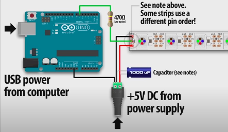

# clase-07

Referentes que se han dado durante la clase
Raúl Zurita: poeta que hablaba sobre la sensibilidad de las palabras.
Lauren Lee McCarthy: creó p5 para que las personas pudiesen expresarse plásticamente por medio de la web.
Renata Gaui: hysterical wearable

## Explicación portafolio y trabajo
Se realizará de manera individual con completa autoría. Si se realiza partiendo desde una base se tiene que citar de manera correspondiente para dar crédito correspondiente, ya que nunca se parte de cero en nada.
También se puede incluir más cosas a un proyecto ya realizado, por medio de un fork.

### Cosas a tener en consideración para utilizar funciones ajenas
Se tiene que tener presente que no solo sea OpenSource, sino que también se puede utilizar. Aunque hay que revisar con qué fines se puede utilizar de manera "gratuita". Por ejemplo que el creador limite su uso a fines académicos y no comerciales.

## Explicación trabajo de Janis
Hacer interacciones con LEDs y botones, utilizando un sensor.
Janis cosas: cuando realizó su primera Solemne le bajaron la nota por no realizar bloques de texto que explicaran el proceso del código, ya sea para qué arduino fue realizado, quién lo creó, etc. También por problemas de depuración de códigos.

## Nuevas formas de hacer *tabs* en arduino
Cuando se realiza una nueva _tab_ se genera los archivos dentro de una misma carpeta y en arduino hay que especificar cuál es su extensión. Por ejemplo, en este caso se tiene, hasta el momento:
1. _ino:_ que corresponde a la extensión de Arduino
2. _h:_ header del cpp
3. _cpp:_ que trabaja con el lenguaje de C++ (lenguaje de programación que utiliza Arduino)

Se pueden realizar funciones y bibliotecas de estas mismas para los distintos proyectos para poder "reutilizar" aquello para facilitar la vida.
Las minúsculas y las mayúsculas se diferencian, ya que si empieza con mayúscula se entiende que hay una clase.

Si se utiliza el siguiente código
```cpp
// ifdef_ifndef.CPP
// compile with: /Dtest /c
#ifndef test
#define final
#endif
```
Se utilizan #ifdef y #ifndef para identificar si se han definido los elementos necesarios para permitir que el código se de bien.
En el caso que no lo esté, lo define.

# Investigación
## Adafruit_CircuitPlayground
La placa _Circuit playground_ es una familia de microcontroladores con LEDs, botones, sensores. 
[Link explicativo](https://code.org/maker/circuitplayground)

Circuit playground ha trabajado con arduino (tiene un código _fix_ para poder codificar por este medio). Sin embargo, es más dirigido hacia python.
[Adafruit de Circuit Playground](https://github.com/adafruit/Adafruit_CircuitPlayground)

## Referencias
[Programar una tira de LEDs RGB en Arduino](https://www.youtube.com/watch?v=BQHMMlEAj3g&ab_channel=PensActius)
La tira de LEDs es proveniente de Adafruit, que se pueden cortar en zonas de "prepicado" para decidir cuál es la cantidad de LEDs que se necesitará por proyecto.



